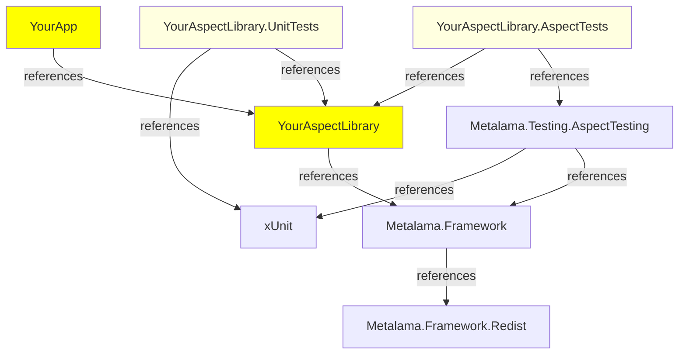
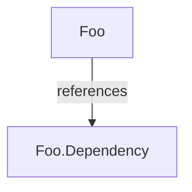

# Compile-Time Testing

The idea of compile-time testing is to create both _input_ test files annotated with aspects and _output_ test files which contain the transformed code (possibly with comments for errors and warnings), and to rely on the compile-time testing framework to automatically execute inputs and verify that the outputs match the expectations.

Concretely, you can follow the following steps (detailed below):

1. Create a test project.
2. For each test case:
   1. Create an input file, say `MyTest.cs`, that includes some target code annotated with the aspect custom attribute.
   2. Run the test.
   3. Verify the transformed code visually. Fix bugs until the transformed code is not as expected.
   4. Copy the test output to a file named with the extension `.t.cs`, say `MyTest.t.cs`.


> [!NOTE]
> For a real-world example, see https://github.com/postsharp/Metalama.Samples. Sample aspects are tested using the approach described here.

## Step 1. Create an aspect test project with Metalama.Testing.AspectTesting

1. Create a Xunit test project.
2. Add the `Metalama.Testing.AspectTesting` package (see <xref:packages> for details).

> [!WARNING]
> Do not add the `Metalama.Testing.AspectTesting` to a project that you do not intend to use _exclusively_ for compile-time tests. This packages significantly changes the semantics of the project items.

Typically, the `csproj` project file of a compile-time test project would have the following content:

```xml
<Project Sdk="Microsoft.NET.Sdk">

    <PropertyGroup>
    <OutputType>Library</OutputType>
    <TargetFramework>net6.0</TargetFramework>
    </PropertyGroup>

    <ItemGroup>
        <PackageReference Include="Microsoft.NET.Test.Sdk" Version="16.7.1" />
        <PackageReference Include="xunit" Version="2.4.1" />
        <PackageReference Include="xunit.runner.visualstudio" Version="2.4.3">
            <IncludeAssets>runtime; build; native; contentfiles; analyzers; buildtransitive</IncludeAssets>
            <PrivateAssets>all</PrivateAssets>
        </PackageReference>
        <PackageReference Include="Metalama.Framework" Version="TODO" />
        <PackageReference Include="Metalama.Testing.AspectTesting" Version="TODO" />
    </ItemGroup>

</Project>
```
### Dependency graph

The following diagram illustrates the typical dependencies between your projects and our packages.



### Customizations performed by Metalama.Testing.AspectTesting

When you import the `Metalama.Testing.AspectTesting` package in a project, the following happens:

1. The `MetalamaEnabled` project property is set to `False`, which completely disables Metalama for the project. Therefore, the `METALAMA` compilation symbol (usable in a directive like `#if METALAMA`) is no longer defined.
  
2. Expected test results (`*.t.cs`) are excluded from the compilation.

3. The Xunit test framework is customized to execute tests from standalone _files_ instead of from methods annotated with `[Fact]` or `[Theory]`.
   

## Step 2. Add a test case

Every source file in the project is a standalone test case. It typically contains some source code to which your aspect is applied, but it can also contain an aspect. You can consider that every file constitutes a project in itself, and this small project receives the project references of the parent compile-time project.

Every test includes:

- A main test file, named say `BlueSky.cs`.
- A file containing the _expected transformed code_ of the main test file, named with the `.t.cs` extension, e.g. `BlueSky.t.cs`. We recommend you do not create this file manually, but you copy the actual output of the test after you are satisfied with it (see below).
- Optionally, one or more auxiliary test files, whose name starts with the main test file, e.g. `BlueSky.*.cs`. Auxiliary files are included in the test compilation but their transformed code is not appended to the `.t.cs` file.

> [!NOTE]
> The name of the main file of your test case cannot include a `.`, except for the `.cs` extension.

For instance, suppose that we are testing the following aspect. This file would typically be included in a class library project.

[!include[Main](../../../code/Metalama.Documentation.SampleCode.AspectFramework/Testing.TheAspect.cs)]

To test this aspect, we create a test file with the following content:

[!include[Main](../../../code/Metalama.Documentation.SampleCode.AspectFramework/Testing.cs)]

### Restricting the compared region of transformed code

If you want the test to compare only one declaration (e.g. a class or a method) of your main file, you can mark this class with the `// <target>` comment. This comment must be on the top of any custom attribute on this declaration, and its spacing must be exactly as shown.

### Include other files

If you want to include in the test compilation other files than auxiliary files based on the file name, you can do it by adding a comment of this form in the main test file:

```cs
// @Include(../Path/To/The/File.cs)
```

The included file will behave just as an auxiliary file.

### Including references to introduced members and interfaces

Because Metalama is disabled at compile- and design-time for a test project, you will have difficulties referencing members that do not exist in your source code but have been introduced by an aspect. Since the IDE and the compiler do not know about Metalama, you will get errors complaining that these members do not exist.

The solution is to wrap the code accessing introduced members with a `#if METALAMA` directive. Because the `METALAMA` symbol is defined when the test framework is running, this code will be taken into account during these tests. However, because it is not defined at design- and compile-time, it this code will be ignored while editing and compiling.

For instance, if the `Planet.Update` method is introduced by an aspect:

```cs
Planet p = new();
#if METALAMA
p.Update( x, y );
#endif
Console.WriteLine( $"{p.X}, {p.Y}");
```

For details about member introductions, see <xref:introducing-members>.

## Step 3. Run the test case

When you create a new test file, your IDE does not discover it automatically. To make the new test appear in the Test Explorer, you first need to run all tests in the project. After the first run, the test will appear in the Test Explorer and it will be possible to execute tests one by one.

You can also run the tests using `dotnet test`.

You can find the output code, transformed by your aspects, at two locations:

- in the _additional output_ of the test message,
- under the `obj/Debug/XXX/transformed` folder, with the name `*.t.cs`.

For the example above, the test output is the following:

[!include[Testing](../../../code/Metalama.Documentation.SampleCode.AspectFramework/Testing.t.cs)]

Verify that the output code matches your expectations. If necessary, fix your aspect and run the test again. Repeat as many times as necessary.

## Step 4. Copy the test output to the expected output

Once you are satisfied with the test output, copy the expected code to `.t.cs` file. For instance, if your test file is named `MyTest.cs`, copy the test output to the file named `MyTest.t.cs`.

> [!WARNING]
> The _Paste_ command of Visual Studio can reformat the code and break the test.

To accept the output of all tests:

1. Commit or stage the changes in your repository, so you will be able to review and possibly rollback the consequences of the next steps.

2. Run the following sequence of commands:

    ```powershell
    # Make sure there is no garbage in the obj\transformed from another commit.
    dotnet build -t:CleanTestOutput

    # Run the tests (it does not matter if they fail)
    dotnet test

    # Copy the actual output to the expected output
    dotnet build -t:AcceptTestOutput
    ```

3. Review each modified file in your repository using the diff tool.

## Skipping a test

To skip a test, add the following comment to the file:

```cs
// @Skipped(I do not want it to run)
```

The text between the parenthesis is the skip reason.

## Advanced features

### Excluding a directory

By default, all files in a compile-time test project are turned into test input files. To disable this behavior for a project directory, create a file named `metalamaTests.json` and add the following content:

```json
{ "Exclude": true }
```

Note that, by default, all source files are excluded from the compilation, even those in the directories that have been excluded by this mechanism. To include the files, define the project property _MetalamaTestAutoExclude_ to _False_ and include/exclude the files manually as needed. Note that the `*.t.cs` files are always excluded.

### Specifying test options

The Metalama test framework supports several test options. They are documented in the <xref: Metalama.Testing.AspectTesting.TestOptions> class.

To set a test option, add a special comment to the test file, for instance:

```cs
// @IncludeAllSeverities
```

Alternatively, to set an option for the whole directory, create a file named `metalamaTests.json` and add properties of the <xref: Metalama.Testing.AspectTesting.TestOptions> class. For instance:

```json
{ "IncludeAllSeverities": true }
```

### Trimming the test output to one or two classes

If you want to limit the test output to one or more declarations (instead as the whole transformed input file), add the `// <target>` comment to the declarations that must be included.

Example:

```cs
class NotIncluded {}

// <target>
class Included {}
```

If no `// <target>` comment is found in the file, the whole file is considered.

### Creating a dependent project

If you need to create a multi-project test, you can create a dependent project by adding a file named `Foo.Dependency.cs` to your test, where `Foo.cs` is your principal test file.



### Creating hierarchical test runners in Rider or Resharper

JetBrains tools do not support the customized compile-time test framework. As a workaround, the Metalama testing framework registers a default test runner that discovers all tests in the current project and add them as test cases for a `[Theory]`-based universal test method.

If you have a large number of tests and want to see a hierarchical view, you can create, in each directory you want, a file named `_Runner.cs`, with the following content (in the namespace of your choice):

[!include[Test Runner](../../../code/Metalama.Documentation.SampleCode.AspectFramework/_Runner.cs)]

The `[CurrentDirectory]` attribute will automatically provide test data for all files located under the directory containing the `_Runner.cs` file as well as any child directory.

Note that custom runners are only supported in Resharper and Rider. They are ignored in other environments and replaced by the customized test framework.