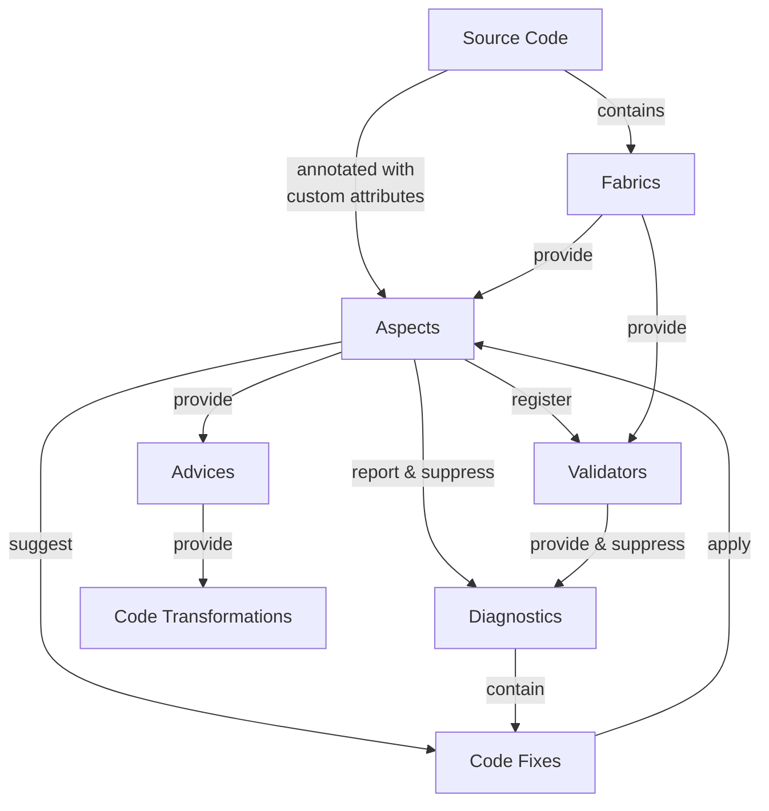

# Architecture

```mermaid
flowchart  TB
    Aspects -- report & suppress --> Diagnostics
    Aspects -- register --> Validators
    Aspects -- suggest --> CodeFixes
    Aspects -- provide --> Advices
    Advices -- provide --> Transformations[Code Transformations]
    SourceCode[Source Code] -- annotated with<br>custom attributes --> Aspects
    SourceCode -- contains --> Fabrics
    Fabrics -- provide --> Aspects
    Fabrics -- provide --> Validators
    Validators -- provide & suppress--> Diagnostics
    Diagnostics -- contain --> CodeFixes
    CodeFixes[Code Fixes] -- apply --> Aspects
   
```