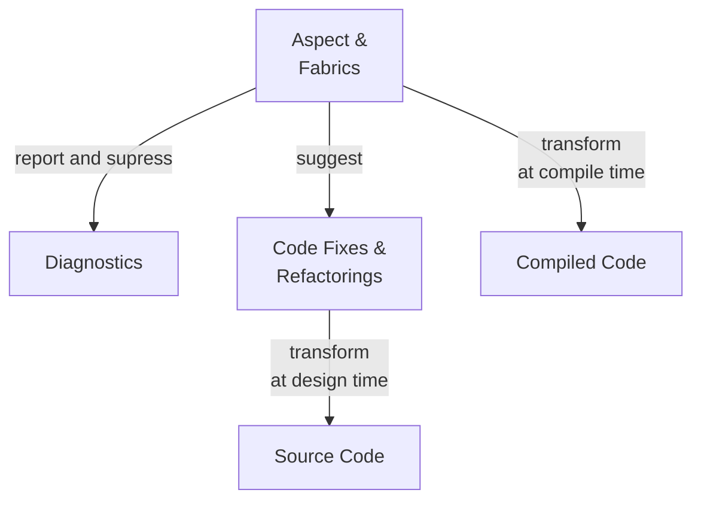

# Metalama

Metalama is a meta-programming framework for C# based on Roslyn, Microsoft's managed compiler platform.

## Features

Metalama has the following principal features:

| Feature | Description |
|---------|-------------|
| __Aspect-Oriented Programming__ | Encapsulate repetitive patterns of code (such as logging, caching, INotifyPropertyChanged, multi-threading) into executable artifacts named _aspects_ that add behaviors to your code at compile time, so that your source code remains clean and succinct &mdash; easier to read and maintain.
| __Code Generation__             | Generate repetitive code, in the editor or at compile time, instead of writing it by hand. With Metalama, you can author your own code actions or refactorings that are available in the lightbulb or screwdriver menu.
| __Code Validation__             | Verify that hand-written code complies to team rules and conventions. Metalama lets you report diagnostics or suppress source code diagnostics simply.

## Documentation structure

| Site | Description |
|------|-------------|
| <xref:conceptual> | Conceptual and procedural documentation |
| <xref:aspect-api> | Aspect API reference |
| <xref:introspection-api> | Introspection API reference |
| <xref:advanced-api> | Advanced API reference |

The conceptual documentation is hosted on https://github.com/postsharp/Metalama.Documentation. You can suggest improvements and corrections using the discussions board, and even submit a pull request.

## Examples

| Link                                                              | Description |
|-------------------------------------------------------------------|------------------------
| [Try Metalama](https://try.metalama.net) | Try Metalama from your browser.|
| [Metalama.Samples](https://github.com/postsharp/Metalama.Samples) | A dozen of open-source examples in a GitHub repo. |

## Licensing

Metalama is currently released under the terms of the Evaluation License of PostSharp.

## Feedback

If you have any feedback regarding Metalama, please [open an issue](https://github.com/postsharp/Metalama/issues/new),
 [start a discussion](https://github.com/postsharp/Metalama/discussions/new), or contact us directly at hello@postsharp.net.

