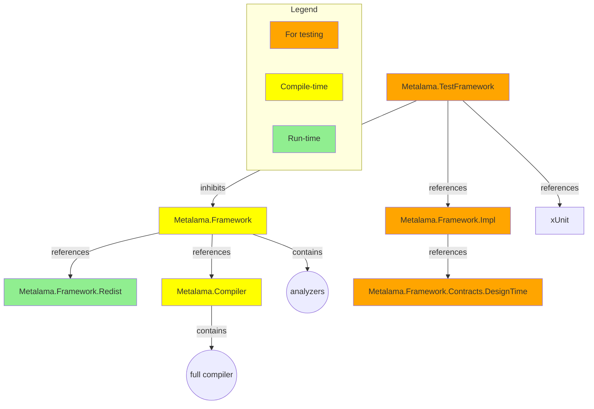

# Packages and Components

Metalama is composed of half a dozen of NuGet packages. It may sound a lot, but some are used only for testing and will never make it to your public packages.

## Package list

| Package Name | Scenarios | Description |
|--|--|--|
| Metalama.Framework.Redist | Run-time | Required to execute code built with Metalama, but does not contain or reference the assets to build with Metalama |
| Metalama.Framework | Compile-time | The typical top-level package for a project that uses Metalama aspects. See <xref:installing>.
| Metalama.Compiler | Compile-time | Replaces Microsoft's C# compiler by Metalama's own fork.
| Metalama.TestFramework | Test | The top-level package for test projects. References `Metalama.Framework` but inhibits most of its behaviors. See <xref:compile-time-testing>. |
| Metalama.Framework.Impl | Test | An opaque implementation assembly required by the test framework. |
| Metalama.Framework.Contracts.DesignTime | Test | An opaque implementation assembly  required by the test framework.. |

## Package diagram

## Visual Studio extension

Additionally to the NuGet packages, Metalama has a [Visual Studio extension](https://marketplace.visualstudio.com/items?itemName=PostSharpTechnologies.metalama) to help you write new aspects This extension is optional but is recommended, at least in the beginning when you are learning the meta template language.