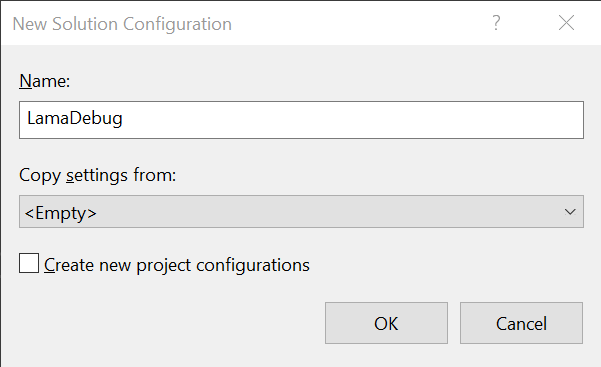

# Debugging Code With Aspects

When debugging code that uses Metalama, by default, the debugger only shows you your original code, without the modifications applied by Metalama. This is convenient when you're using an existing aspect, but when you're developing an aspect, you want to be able to see the transformed code.

There are two options to debug the transformed code.


## Option 1. Using the LamaDebug build configuration

The easiest option to debug the transformed code (instead of the source code) is to switch to the build configuration named `LamaDebug`. This build configuration is automatically defined, besides the default `Debug` and `Release` configurations, for any project that imports the _Metalama.Framework_ package.

To create a LamaDebug build configuration using Visual Studio:

1. In the _Build_ menu, choose _Configuration Manager_.
2. In the _Active solution configuration_ list box, choose _<New>_.
3. Fill this dialog as follows:

    * Name: `LamaDebug` (or your own name).
    * Copy settings from: `<Empty>`.
    * Create new project configurations: `No`.

     

    
4. Then, make sure that the solution configuration uses the project configuration named `LamaDebug` for each project that uses Metalama.


The benefit of this approach is that you can easily switch between source code and transformed code debugging.


## Option 2. Settings properties manually

Alternatively, you can set the following MSBuild properties:

```xml
<PropertyGroup>
    <MetalamaFormatOutput>True</MetalamaFormatOutput>
    <MetalamaDebugTransformedCode>True</MetalamaDebugTransformedCode>
    <MetalamaEmitCompilerTransformedFiles>True</MetalamaEmitCompilerTransformedFiles>
</PropertyGroup>
```

For details about these properties, see <xref:msbuild-properties>.


> [!div class="see-also"]
> <xref:debugging-aspects>