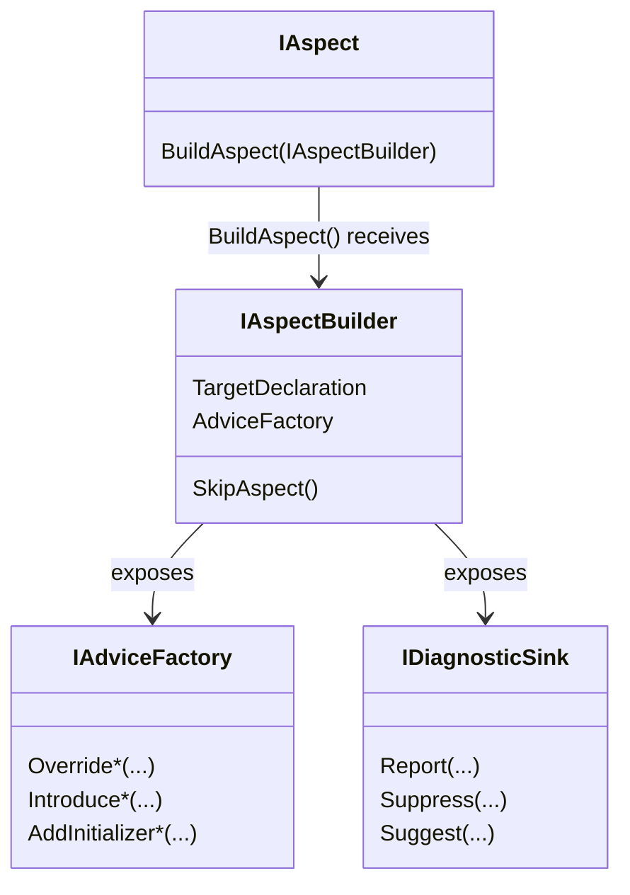

# Understanding the aspect framework design

[comment]: # (TODO: what is the relationship between aspects and attributes)
[comment]: # (TODO: what is the Aspect base class)

Up to now, you have seen how to create simple aspects using the <xref:Metalama.Framework.Aspects.OverrideMethodAspect> and <xref:Metalama.Framework.Aspects.OverrideFieldOrPropertyAspect>. These classes can be considered _API sugar_ designed to ease the creation of your first aspects. To go further, you have understand the design of the Metalama aspect framework.

## Class diagram

An aspect is, by definition, a class that implements the <xref:Metalama.Framework.Aspects.IAspect`1> generic interface. The generic parameter of this interface is the type of declarations to which the aspect can be applied. For instance, an aspect that can be applied to a method must implement the `IAspect<IMethod>` interface and an aspect that can be applied to a named type must implement `IAspect<INamedType>`.

The aspect author can use the <xref:Metalama.Framework.Aspects.IAspect`1.BuildAspect*> method, inherited from the <xref:Metalama.Framework.Aspects.IAspect`1> interface, to build the aspect _instance_ applied on a specific _target declaration_, thanks to an <xref:Metalama.Framework.Aspects.IAspectBuilder`1>.

## Abilities of aspects

### 1. Transforming code

Aspects can perform the following transformations to code:

* Apply a template to an existing method, i.e. add generated code to user-written code.
* Introduce a new generated member to an existing type.
* Implement an interface into a type.

For details, see <xref:advising-code>.

### 2. Reporting and suppressing diagnostics

Aspects can report diagnostics (a single word for errors, warnings, and information messages), and can suppress diagnostics reported by the C# compiler, analyzers, or other aspects.

For details about this feature, see <xref:diagnostics>.

### 3. Suggesting code fixes

Aspects can suggest code fixes to any diagnostic they report, or suggest code refactorings.

### 4. Validating the code that references the target declaration

Aspects can validate not only the target code, but also any _reference_ to the target declaration.

See <xref:validation>.

### 5. Defining its eligibility

Aspects can define which declarations they can be legally applied to.

See <xref:eligibility>.

### 6. Adding other aspects to be applied

Aspects can add other aspects to the target code.

See <xref:child-aspects>.

### 7. Disabling itself

If an aspect instance decides that it cannot be applied to the target to which it has been applied, its implementation of the <xref:Metalama.Framework.Aspects.IAspect`1.BuildAspect*> method can call the <xref:Metalama.Framework.Aspects.IAspectBuilder.SkipAspect> method. The effect of this method is to prevent the aspect from providing any advice or child aspect and to set the <xref:Metalama.Framework.Aspects.IAspectInstance.IsSkipped> to `true`.

The aspect may or may not report a diagnostic before calling <xref:Metalama.Framework.Aspects.IAspectBuilder.SkipAspect>. Calling this method does not report any diagnostic.

### 8. Customizing its appearance in the IDE

By default, an aspect class is represented in the IDE by the name of the class trimmed of its `Attribute` suffix, if any. To override the default name, annotate the aspect class with the <xref:System.ComponentModel.DisplayNameAttribute> annotation.

## Examples

### Example: an aspect targeting methods, fields and properties

The following example shows an aspect that targets methods, fields and properties with a single implementation class.

[!metalama-sample ~/code/Metalama.Documentation.SampleCode.AspectFramework/LogMethodAndProperty.cs name="Aspect Targeting Methods, Fields and Properties"]

[comment]: # (TODO: Code model versioning)

