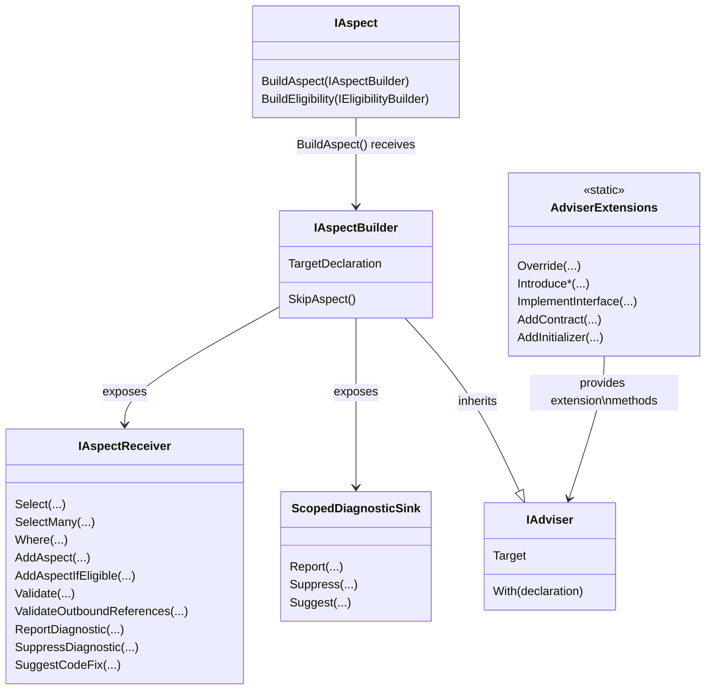

# Understanding the aspect framework design

Until now, you have learned how to create simple aspects using the <xref:Metalama.Framework.Aspects.OverrideMethodAspect> and <xref:Metalama.Framework.Aspects.OverrideFieldOrPropertyAspect>. These classes can be viewed as _API sugar_, designed to simplify the creation of your first aspects. Before going deeper, it is essential to understand the design of the Metalama aspect framework.

## Class diagram

By definition, an aspect is a class that implements the <xref:Metalama.Framework.Aspects.IAspect`1> generic interface. The generic parameter of this interface represents the type of declarations to which the aspect can be applied. For instance, an aspect applicable to a method must implement the `IAspect<IMethod>` interface, while an aspect applicable to a named type must implement `IAspect<INamedType>`.

The aspect author can utilize the <xref:Metalama.Framework.Aspects.IAspect`1.BuildAspect*> method, inherited from the <xref:Metalama.Framework.Aspects.IAspect`1> interface, to construct the aspect _instance_ applied to a specific _target declaration_, using an <xref:Metalama.Framework.Aspects.IAspectBuilder`1>.

## Abilities of aspects

### 1. Transforming code

Aspects can perform the following transformations to code:

* Apply a template to an existing method, i.e., add generated code to user-written code.
* Introduce a newly generated member to an existing type.
* Implement an interface into a type.

For more details, refer to <xref:advising-code>.

### 2. Reporting, suppressing diagnostics and suggesting code fixes

Aspects can report diagnostics (a term encompassing errors, warnings, and information messages) and suppress diagnostics reported by the C# compiler, analyzers, or other aspects.

Aspects can suggest code fixes for any diagnostic they report or propose code refactorings.

For more information about this feature, refer to <xref:diagnostics>.

### 3. Performed advanced code validations

The <xref:Metalama.Framework.Aspects.IAspectBuilder`1.Outbound?text=builder.Outbound> property allows to register validators for advanced scenarios:

* validate the target declaration after it will be transformed by all aspects,
* validate any _references_ to the target declaration.

Refer to <xref:aspect-validating>.

### 4. Adding other aspects to be applied

The <xref:Metalama.Framework.Aspects.IAspectBuilder`1.Outbound?text=builder.Outbound> property also allows to add other aspects to the target code.

Refer to <xref:child-aspects>.

### 5. Defining its eligibility

Aspects can define which declarations they can be legally applied to.

Refer to <xref:eligibility>.

### 7. Disabling itself

If an aspect instance decides it cannot be applied to its target, its implementation of the <xref:Metalama.Framework.Aspects.IAspect`1.BuildAspect*> method can call the <xref:Metalama.Framework.Aspects.IAspectBuilder.SkipAspect> method. The effect of this method is to prevent the aspect from providing any advice or child aspect and to set the <xref:Metalama.Framework.Aspects.IAspectInstance.IsSkipped> to `true`.

The aspect may or may not report a diagnostic before calling <xref:Metalama.Framework.Aspects.IAspectBuilder.SkipAspect>. Calling this method does not report any diagnostic.

### 8. Customizing its appearance in the IDE

By default, an aspect class is represented in the IDE by the class name trimmed of its `Attribute` suffix, if any. To override the default name, annotate the aspect class with the <xref:System.ComponentModel.DisplayNameAttribute> annotation.

## Examples

### Example: an aspect targeting methods, fields, and properties

The following example demonstrates an aspect that targets methods, fields, and properties with a single implementation class.

[!metalama-test ~/code/Metalama.Documentation.SampleCode.AspectFramework/LogMethodAndProperty.cs name="Aspect Targeting Methods, Fields and Properties"]

