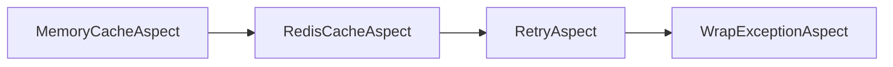

# Ordering aspects

When multiple aspect classes are defined, the execution order becomes critical.

## Concepts

### Per-project ordering

> [!NOTE]
> Defining the execution order is the primary responsibility of the aspect library author, not the users of the aspect library. Aspect libraries that know about each other should set their execution order properly to avoid user confusion.

Each aspect library should define the execution order of the aspects it introduces. This order should consider not only other aspects within the same library but also aspects defined in referenced aspect libraries.

When a project employs two unrelated aspect libraries or contains aspect classes, it must define the ordering within the project itself.

### Order of application versus order of execution

Metalama adheres to the "matryoshka" model: your source code is the innermost doll, and aspects are added _around_ it. The fully compiled code, inclusive of all aspects, resembles a fully assembled matryoshka. Executing a method is akin to disassembling the matryoshka: you commence with the outermost shell and progress to the original implementation.


It's crucial to remember that while Metalama, at _build time_, constructs the matryoshka from the inside out, at _run time_ the code is executed from the outside in; in other words, the source code is executed _last_.

Therefore, the build-time order of applying aspects order and the run-time order of executing aspects are usually _opposite_. 

## Specifying the execution order

By default, the run-time execution order of aspects is alphabetical. This order is not intended to be correct but at least it is deterministic.

The execution order of aspects must be defined using the <xref:Metalama.Framework.Aspects.AspectOrderAttribute> assembly-level custom attribute. The order of the aspect classes in the attribute corresponds to their execution order. To avoid ambiguities, you must explicitly supply the <xref:Metalama.Framework.Aspects.AspectOrderDirection> value (`RunTime` or `CompileTime`) for which you are specifying the aspect order.

The two following snippets are equivalent:

```cs
using Metalama.Framework.Aspects;
[assembly: AspectOrder( AspectOrderDirection.RunTime, typeof(Aspect1), typeof(Aspect2), typeof(Aspect3))]
```

```cs
using Metalama.Framework.Aspects;
[assembly: AspectOrder( AspectOrderDirection.CompileTime, typeof(Aspect3), typeof(Aspect2), typeof(Aspect1))]
```

This custom attribute defines the run-time execution order:


### Partial relationships

You can specify _partial_ order relationships. The aspect framework will merge all partial relationships and determine the global order for the current project.

For instance, the following code snippet is equivalent to the previous ones:

```cs
using Metalama.Framework.Aspects;
[assembly: AspectOrder( AspectOrderDirection.RunTime, typeof(Aspect1), typeof(Aspect2))]
[assembly: AspectOrder( AspectOrderDirection.RunTime, typeof(Aspect2), typeof(Aspect3))]
```

These two attributes define the following relationships:

This is akin to mathematics: if we have `a < b` and `b < c`, then we have `a < c`, and the ordered sequence is `{a, b, c}`.

If you specify conflicting relationships or import an aspect library that defines a conflicting order, Metalama will emit a compilation error.

> [!NOTE]
> Metalama will merge all `[assembly: AspectOrder(...)]` attributes that it finds not only in the current project but also in all referenced projects or libraries. Therefore, you don't need to repeat the `[assembly: AspectOrder(...)]` attributes in all projects that use aspects. It is sufficient to define them in projects that define aspects.

### Inherited aspects

By default, relationships specified with <xref:Metalama.Framework.Aspects.AspectOrderAttribute> also apply to derived aspect classes. 

For instance, consider the following aspects:

```c#
abstract class ExceptionHandlingAspect;
class RetryAspect : ExceptionHandlingAspect;
class WrapExceptionAspect : ExceptionHandlingAspect;

abstract class CacheAspect;
class B1 : MemoryCacheAspect;
class B2 : RedisCacheAspect;
```

Consider the following order attributes, ordering only abstract aspects:

```cs
using Metalama.Framework.Aspects;
[assembly: AspectOrder( AspectOrderDirection.RunTime, typeof(CacheAspect), typeof(ExceptionHandlingAspect))]
```

We don't explicitly order concrete aspect classes, so alphabetical ordering will automatically apply.

The resulting run-time aspect order will be the following:




To disable this behavior, set the <xref:Metalama.Framework.Aspects.AspectOrderAttribute.ApplyToDerivedTypes> property to `false`.

### How does it work?

Under the hood, Metalama performs a [topological sort](https://en.wikipedia.org/wiki/Topological_sorting) on a graph composed of all relationships found in the current project and all its dependencies.

When a pair of aspects do not have any specific ordering relationship, from any source, Metalama falls back to _alphabetical_ ordering to avoid any non-determinism.


### Example

The following code snippet demonstrates two aspects that add a method to the target type and display the list of methods defined on the target type before the aspect was applied. The execution order is defined as `Aspect1 < Aspect2`. From this example, you can discern that the order of application of aspects is opposite. `Aspect2` is applied first and sees the source code, then `Aspect1` is applied and sees the method added by `Aspect1`. The modified method body of `SourceMethod` shows that the aspects are executed in this order: `Aspect1`, `Aspect2`, then the original method.

[!metalama-test  ~/code/Metalama.Documentation.SampleCode.AspectFramework/Ordering.cs name="Ordering"]


## Several instances of the same aspect type on the same declaration

When multiple instances of the same aspect type are applied to the same declaration, one instance of the aspect, known as the _primary_ instance, is selected and applied to the target. The other instances, known as _secondary_ instances, are exposed on the <xref:Metalama.Framework.Aspects.IAspectInstance.SecondaryInstances?text=IAspectInstance.SecondaryInstances> property, which you can access from <xref:Metalama.Framework.Aspects.meta.AspectInstance?text=meta.AspectInstance> or <xref:Metalama.Framework.Aspects.IAspectBuilder.AspectInstance?text=builder.AspectInstance>. The aspect implementation is responsible for determining what to do with the secondary aspect instances.

The primary aspect instance is the instance that has been applied closest to the target declaration. The sorting criteria are as follows:
    1. Aspects defined using a _custom attribute_.
    2. Aspects added by another aspect (child aspects).
    3. Aspects inherited from another declaration.
    4. Aspects added by a fabric.

Within these individual categories, the ordering is currently undefined, meaning the build may be nondeterministic if the aspect implementation relies on that ordering.

[comment]: # (TODO: Example of handling secondary instances)

