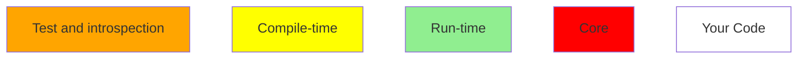
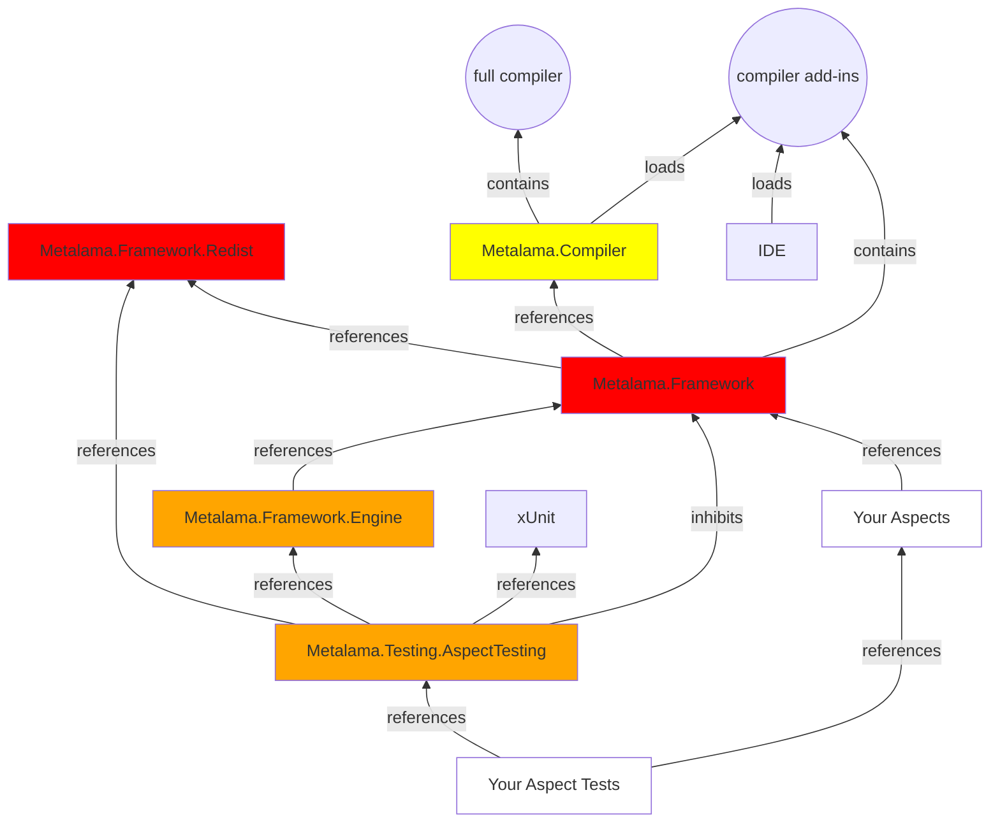
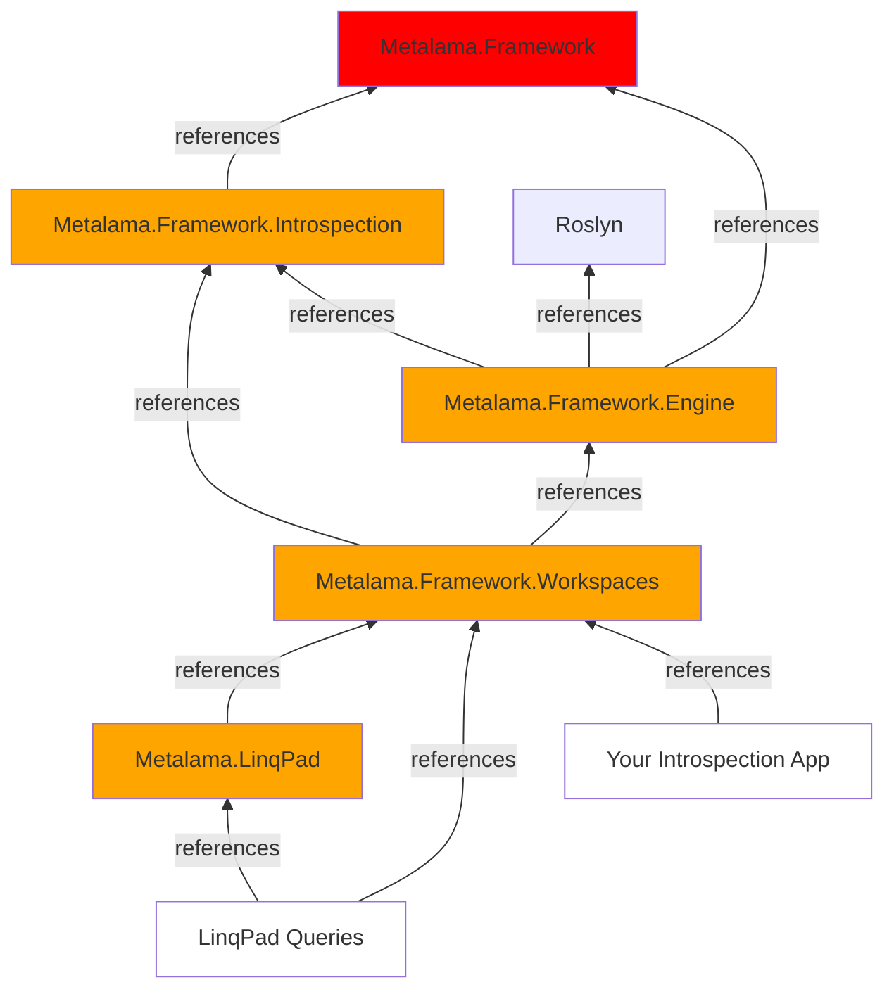
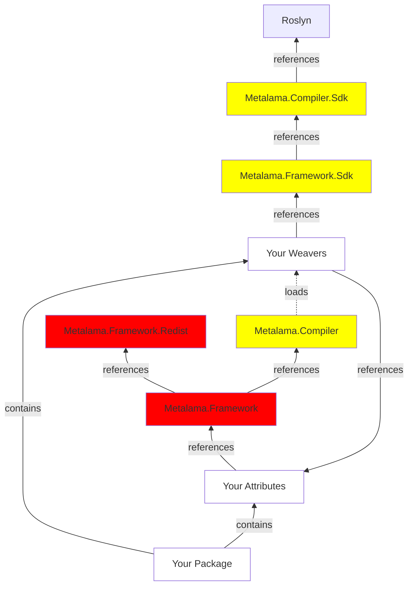

# List of NuGet Packages

Metalama is composed of many NuGet packages. Some are used only for testing or troubleshooting and will never be included in your public packages.

## Package list 

| Package Name | Scenarios | Description |
|--|--|--|
| Metalama.Framework.Redist | Run-Time Execution | The only package required to execute code built with Metalama. It does not contain or reference the assets to _build_ with Metalama. |
| Metalama.Framework | Compiling, Testing, Introspection | The typical top-level package for a project that defines Metalama aspects.
| Metalama.Compiler | Compiling | Replaces Microsoft's C# compiler with Metalama's own fork.
| Metalama.Compiler.Sdk | Compiling | Defines the extensibility API of `Metalama.Compiler`.
| Metalama.Framework.Sdk | Compiling | Defines the low-level extensibility API of `Metalama.Framework` (extensions using the Roslyn API). |
| Metalama.Testing.AspectTesting | Testing | The top-level package for test projects. References `Metalama.Framework` but inhibits most of its behaviors. See <xref:aspect-testing>. |
| Metalama.Framework.Engine | Testing, Introspection | An opaque implementation assembly required by the testing and introspection packages. |
| Metalama.Framework.Introspection | Introspection | Allows to query the code model representing the output of the Metalama process.
| Metalama.Framework.Workspaces | Introspection | Allows any application to load a Visual Studio project or solution and to represent its code model and the Introspection of the Metalama process.

## Package diagrams

### Legend

### Building, executing and testing

### Introspection

### SDK

