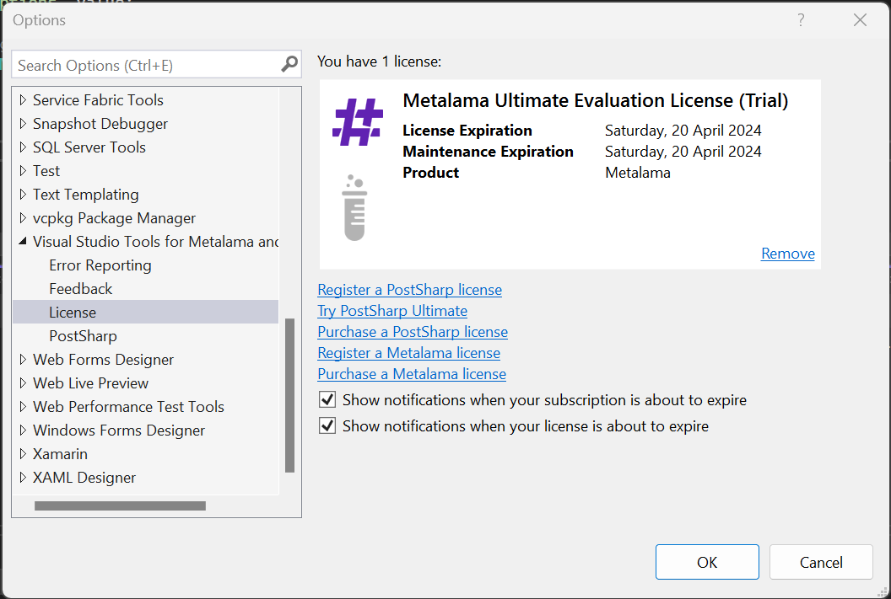

# Registering a license

When you use Metalama for the first time, the license registration UI will open, where you can choose between the 45-day evaluation mode, the Metalama Free, or registering a license key.

To change your license after the activation UI has closed, you can choose one of the following approaches.

## With the Visual Studio tooling

You can manage your Metalama licenses using Visual Studio Tools for Metalama and PostSharp. For instructions on how to install it, see <xref:install-vsx>.

To access these options:

1. In the top-level menu, choose _Extensions_ > _Metalama + PostSharp_ > _Options_.
2. Go to the _License_ tab.





## With the command-line tool

You can manage licensing options using the `metalama` CLI tool.

First, install the Metalama Command Line Tools as detailed in <xref:dotnet-tool>.

The following commands are available:

| Command | Description |
|-------------|-----------------|
| `metalama license list` | Shows the current license options. |
| `metalama license try` | Activate the 45-day evaluation period of Metalama Ultimate. |
| `metalama license free` | Activate Metalama Free, a free but limited edition of Metalama. |
| `metalama license register <LICENSE KEY>` | Register a license key.


## By editing the configuration file

To manually register a license for the current user, do the following:

1. Open the Metalama licensing JSON configuration file `licensing.json`. This file is located in the `%appdata%\\.metalama` directory on Windows, and in the `~/.metalama` directory on Linux and Mac.
2. Set the license key as the `license` value. If the file doesn't exist, it should contain the following content (where `123-ABCDEFGHIJKLMNOPQRSTUVXYZ` is a placeholder for the actual license key):

   ```json
   {
     "license": "123-ABCDEFGHIJKLMNOPQRSTUVXYZ"
   }
   ```

## With an environment variable or MSBuild property

The license key can be stored as the value of the `MetalamaLicense` MSBuild property. This allows for the following:

- Storing the license as a value of the `MetalamaLicense` environment variable.
- Storing the license in the source code repository using the [Directory.Build.props](https://learn.microsoft.com/en-us/visualstudio/msbuild/customize-your-build?view=vs-2022#directorybuildprops-and-directorybuildtargets) file.
- Storing the license in the `.csproj` project file.


