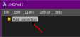
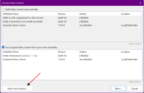
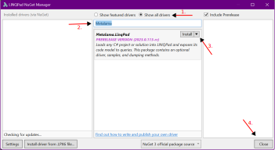
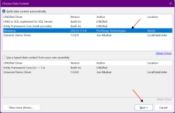
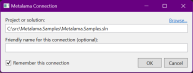
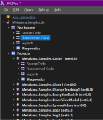

# Inspecting a project using LINQPad

LINQPad is a widely used tool for interactively querying databases using Language Integrated Query (LINQ) syntax. It enables you to write and execute LINQ queries against various data sources, including SQL databases, XML documents, and .NET objects. With the Metalama driver for LINQPad, you can also query your source code as though it were a database.

## Benefits

We developed the Metalama driver for LINQPad to assist developers and architects in building and testing their Metalama aspects and fabrics. However, this driver can be utilized even if you are not using Metalama.

With this driver, you can:

* Test code queries using the same <xref:Metalama.Framework.Code> API as the one used in aspects and fabrics,
* List the target declarations of aspects,
* Inspect the outcome of aspects, i.e., the output code transformations, diagnostics, or child aspects,
* Query the resulting code mode.

> [!NOTE]
> The Metalama.LinqPad driver is [open-source](https://github.com/postsharp/Metalama.LinqPad).


## Installing the driver

To install the Metalama driver for LINQPad, follow these steps:

1. In the Explorer tool window, click _Add connection_.

    

2. Click on _View more drivers_.

     

3. In the NuGet LINQPad Manager dialog:

    1. Select _Show all drivers_
    2. Type _Metalama_
    3. Select `Metalama.LinqPad` and click _Install_.
    4. Accept a few disclaimers and wait. Then click _Close_.

    

## Opening a project or solution

1. In the Explorer tool window, click _Add connection_.

    

2. Choose the Metalama driver and click _Next_.

    

3. Specify the path to the C# project or solution, then click _Ok_.

    

> [!WARNING]
> The version of the `Metalama.LinqPad` driver must be __higher or equal__ to the version of the `Metalama.Framework` package used in projects.

## Data structure

Upon adding a C# project or solution to LINQPad, you should see the following structure:

   

The _Workspace_ folder allows you to query the entire workspace in a single query, i.e., _all_ projects for _all_ target frameworks. Conversely, under the _Projects_ folder, you see subfolders for individual projects, and queries will be limited to the selected combination of project and target framework.

Under the level of workspaces and projects, you see three subfolders:

* _Source code_ allows you to query the code _before_ any transformation, i.e., literally, your source code.
* _Transformed code_ exposes the code _after_ all transformations.
* _Aspects_ lists aspect classes, aspect instances, advice, and transformations.

For instance, the following query has been created from the _Workspace_ folder. It lists all types in the workspace:

```cs
workspace.SourceCode.Types
```

This query, however, is limited to the `Metalama.Samples.Cache1` project for the target framework `net6.0`.

```cs
workspace.GetProject("Metalama.Samples.Cache1", "net6.0").SourceCode.Types
```

The `workspace` object is of type <xref:Metalama.Framework.Workspaces.Workspace>, which implements the <xref:Metalama.Framework.Workspaces.IProjectSet> interface. The <xref:Metalama.Framework.Workspaces.Project> class represents a combination of project and target framework.

For details, see the <xref:Metalama.Framework.Workspaces> namespace.

## Querying Metalama Projects Without the Driver

Instead of using the driver and a connection, you can use the `Metalama.LinqPad` package from any query.

You should start your query with the M<xref:Metalama.Framework.Workspaces.WorkspaceCollection> class, then get the <xref:Metalama.Framework.Workspaces.WorkspaceCollection.Default>  property and call the <xref:Metalama.Framework.Workspaces.WorkspaceCollection.Load*> method to load your project or solution.

For instance, the following code defines the `workspace` variable and gives it an identical meaning to if you were using the driver:

```cs
var workspace = WorkspaceCollection.Default.Load(@"C:\src\Metalama.Samples\examples\log\log-3\Metalama.Samples.Log3.csproj")
```

To benefit from optimal rendering, add the following code to `My Extensions`:

```cs
public static class MyExtensions
{
	// Write custom extension methods here. They will be available to all queries.
 	public static object? ToDump(object obj) => Metalama.LinqPad.MetalamaDumper.ToDump(obj);
}
```

## Permalinks to a specific declaration

When you use the Metalama LinqPad driver or the <xref:Metalama.LinqPad.MetalamaDumper> class, objects that represent a code declaration have a virtual property called _Permalink_. The permalink is a C# expression that you can use to retrieve the declaration from a new query window.

Here is an example of a permalink that represents the `_logger` field of the `LogAttribute` class in the `Metalama.Samples.Log4` project for the target framework `net6.0`.

```cs
workspace.GetDeclaration("Metalama.Samples.Log4", "net6.0", "F:LogAttribute._logger", false)
```

## Querying Metalama projects without LinqPad

If you want to run a Metalama query from a different application, add a reference to the `Metalama.Framework.Workspaces` package.

> [!div class="see-also"]
> <xref:Metalama.Framework.Workspaces>
> <xref:Metalama.Framework.Introspection>


