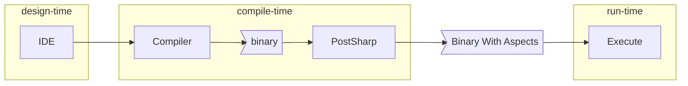
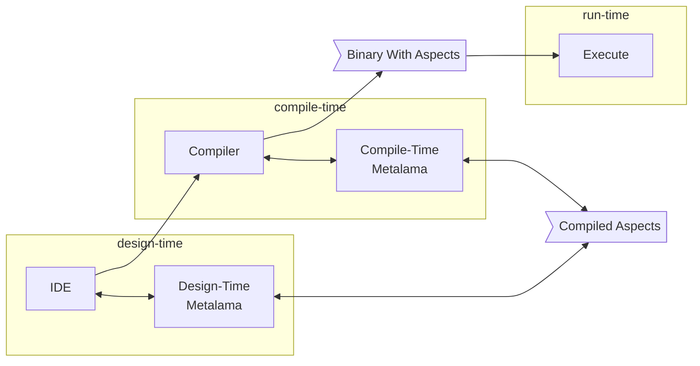
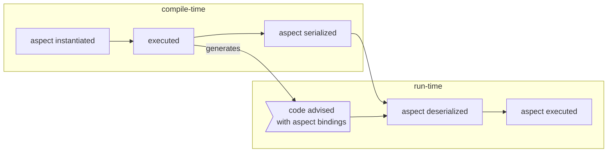
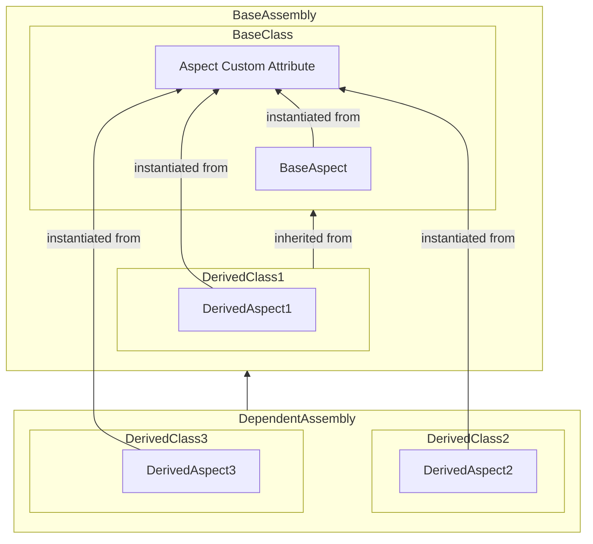
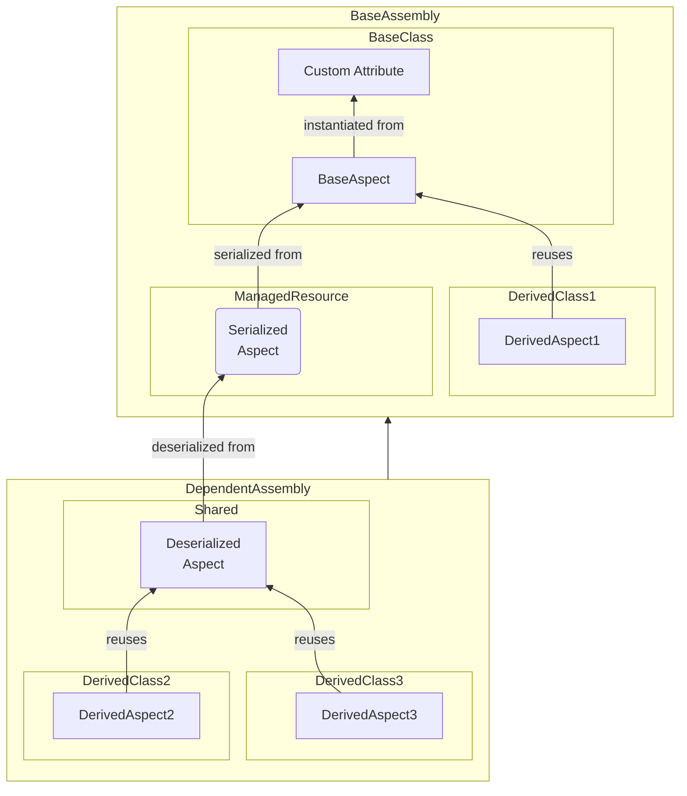

# Differences between Metalama and PostSharp

This article covers the major architectural differences between Metalama and PostSharp in a rather theoretical style. You can probably skip it on first reading.

## Metalama is a compiler add-in

A major difference between Metalama and PostSharp is that while PostSharp is a post-compiler, i.e. a process that runs after the compiler and post-processes the output of the compiler, Metalama is a compiler add-in, and gets executed _both_ at design- and at compile-time.

So how does Metalama execute aspects? Metalama creates a sub-project from your main project, and this sub-project contains only compile-time code, e.g. aspects, fabrics, and their dependencies. Only this sub-project is compiled and executed at design- or compile-time.

While PostSharp loads the whole project (compiled as an assembly) in the .NET runtime, Metalama only loads the sub-project that contains compile-time code.

### Illustrations

#### PostSharp Architecture

#### Metalama Architecture

## Metalama aspects are compile-time-only

In PostSharp, aspect classes are instantiated at compile time, serialized and stored as a managed resource in the assembly being built, then deserialized at run time, and executed. Therefore, in PostSharp, some aspect code is executed at compile time, and some is executed at run time.

In Metalama, aspects are never executed at run time. Aspects provide code templates, and templates are expanded at compile time. Templates generate C# code, and only this generated code is executed at run time.

### Illustration

#### Aspect lifetime in PostSharp

#### Aspect lifetime in Metalama

### Implications

The difference in aspect lifetime has major implications for the way aspects are designed.

* **Metalama templates should generate succinct code.**  In PostSharp, advice methods could be long and complex because they were independent C# methods, compiled and JIT-compiled just once, and executed at run time. However, in Metalama, advice methods are templates. They can be long, but the code they are generating must preferably be short. This code will need to be compiled and JIT-compiled as many times as the advice is applied, so potentially thousands of times. Any logic that may repeat itself should be moved into run-time helper classes.

* **Aspects can no longer "hold" run-time state**. In PostSharp, aspect fields could hold any run-time state required by the aspect. In Metalama, if an aspect needs a run-time state, it has to _introduce_ a field into the target class (see <xref:introducing-members> for details).

## Aspect instances in Metalama can be shared by several declarations

Some aspects are applied to a declaration in a project but affect other projects that reference the main project (as a project or as a package). For instance, an aspect may be applied to a base class in a project. If this aspect is inheritable, it will also be automatically applied to all classes that derive from this base class. For details, see <xref:aspect-inheritance>.

The way how inheritance is implemented differs between Metalama and PostSharp.

In PostSharp, each inherited aspect instance is instantiated again from the custom attribute from which it stems (i.e. to be exact, it is deserialized from the custom attribute). This mechanism is used for intra-project inheritance, as well as for cross-project inheritance.

In Metalama, the mechanism is different inside a project than across projects.

Inside a project, the same aspect instance is _shared_ among all declarations that inherit this aspect. This is why aspect classes should be written in an immutable style.

For cross-project inheritance or validators,  inheritable aspect instances are _serialized_ and stored as a managed resource using the <xref:Metalama.Framework.Serialization> namespace into the assembly being built. In child projects, one new aspect instance is created by deserializing the serialized aspect of the base declaration, and this deserialized instance is then shared by all derived declarations inheriting the aspect.

### Illustrations

#### Cross-project aspects in PostSharp

#### Cross-project aspects in Metalama

### Implications

* **In Metalama, aspect classes must be written in an immutable style.** Since aspect instances may be reused among several declarations, they cannot store state that is specific to a target declaration. For details, see <xref:sharing-state-with-advice>.

