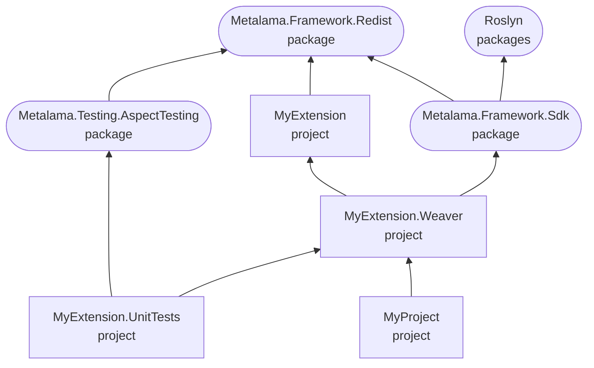

# Creating a Metalama SDK solution structure

A Metalama SDK solution typically contains the following projects:

* The _public_ project (`MyExtension` in the diagram below) contains the classes exposed to the consumers of your solution. This project is a standard class library and it must target _at least_ .NET Standard 2.0.
* The _weaver_ project (`MyExtension.Weaver` in the diagram below) contains the implementation of the public API thanks to the Metalama SDK and Roslyn APIs. This project is deployed as a _Roslyn analyzer_. It must target _only_ .NET Standard 2.0.
* The _test_ project (`MyExtension.UnitTests` in the diagram below)  is optional but recommended. It contains the test suite.
* Consumer projects (`MyProject` in the diagram below) may be a part of the same solution or may reference the Metalama extension as a NuGet package.

## Dependency diagram

The following graph illustrates the different projects and their dependencies.



## 1. The public API project

The public project:

* references `Metalama.Framework`;
* targets at least `netstandard2.0`, but can target other frameworks too;
* redefines the `PackageId` property to add the `.Redist` suffix to the assembly name;
* typically makes internals visible to the weaver project.

[comment]: # (TODO: If public API project targets something newer, then dependecy from Weaver to this project does not work.)
[comment]: # (TODO: If the dependency from Weaver is not included (as in Costura), then packaging doesn't work.)

### Example

[!code-xml[](~\source-dependencies\Metalama.Community\src\Metalama.Community.Virtuosity\Metalama.Community.Virtuosity\Metalama.Community.Virtuosity.csproj)]

## 2. The weaver project

The weaver project:

* typically has a name that ends with the `.Weaver` suffix, although not following this convention has no impact;
* references `Metalama.Framework.Sdk`;
* typically references the public project, although this is not always necessary;
* targets exclusively `netstandard2.0`;
* is typically the main project of the NuGet package;
* redefines the `PackageId` to the real package name, i.e. removes the `.Weaver` suffix from the package name.

### Example

[!code-xml[](~\source-dependencies\Metalama.Community\src\Metalama.Community.Virtuosity\Metalama.Community.Virtuosity.Weaver\Metalama.Community.Virtuosity.Weaver.csproj)]

## 3. The unit test project

The unit test project:

* references the public project with `OutputItemType="Analyzer"`;
* references the weaver project with both `OutputItemType="Analyzer"` and `ReferenceOutputAssembly="false"`;
* references the following packages:
  * `Metalama.Testing.AspectTesting`
  * `Microsoft.NET.Test.Sdk`
  * `xunit`
  * `xunit.runner.visualstudio`
* can target any platform supported by the test framework.

### Example

[!code-xml[](~\source-dependencies\Metalama.Community\src\Metalama.Community.Virtuosity\Metalama.Community.Virtuosity.UnitTests\Metalama.Community.Virtuosity.UnitTests.csproj)]

## 4. Consuming projects in the same solution

If the consuming projects are a part of the same solution as the Metalama extension projects, they need to:

* reference the public project with `OutputItemType="Analyzer"` so that it is included both at run time and compile time;
* reference the weaver project with both `OutputItemType="Analyzer"` and `ReferenceOutputAssembly="false"` so that it is included only at compile time.
* reference the `Metalama.Framework` package.

### Example

```xml
<Project Sdk="Microsoft.NET.Sdk">

  <PropertyGroup>
    <OutputType>Exe</OutputType>
    <TargetFramework>net6.0</TargetFramework>
  </PropertyGroup>

  <ItemGroup>
    <ProjectReference Include="..\Metalama.Open.Virtuosity.Weaver\Metalama.Open.Virtuosity.Weaver.csproj" OutputItemType="Analyzer" ReferenceOutputAssembly="false" />
    <ProjectReference Include="..\Metalama.Open.Virtuosity\Metalama.Open.Virtuosity.csproj" OutputItemType="Analyzer" />
    <PackageReference Include="Metalama.Framework" Version="$(MetalamaVersion)" />
  </ItemGroup>

</Project>
```

## 5. Consuming projects in a different solution

If the consuming projects are not part of the same solution as the Metalama extension projects, they need to:

* reference the main package of the extension, produced from the weaver project.

### Example

[!code-xml[](~\source-dependencies\Metalama.Community\src\Metalama.Community.Virtuosity\Metalama.Community.Virtuosity.TestApp\Metalama.Community.Virtuosity.TestApp\Metalama.Community.Virtuosity.TestApp.csproj)]