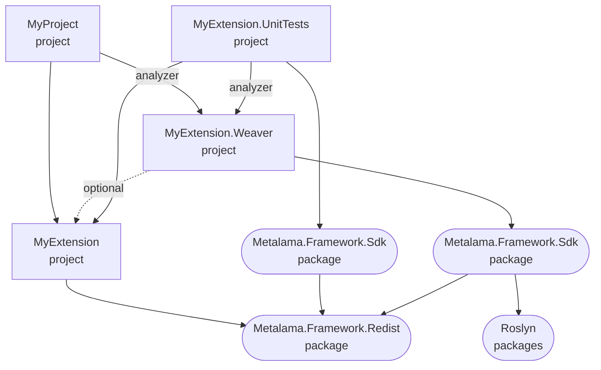

# Creating a Metalama SDK solution structure

A Metalama SDK solution typically contains the following projects:

* The _public_ project (`MyExtension` in the diagram below) contains the classes exposed to the consumers of your solution. This project is a standard class library and it must target _at least_ .NET Standard 2.0.
* The _weaver_ project (`MyExtension.Weaver` in the diagram below) contains the implementation of the public API thanks to the Metalama SDK and Roslyn APIs. This project is deployed as a _Roslyn analyzer_. It must target _only_ .NET Standard 2.0.
* The _test_ project (`MyExtension.UnitTests` in the diagram below)  is optional but recommended. It contains the test suite.
* Consumer projects (`MyProject` in the diagram below) may be a part of the same solution, or may reference the Metalana extension as a NuGet package.

## Dependency diagram

The following graph illustrates the different projects and their dependencies.



## NuGet packaging

Both the public assembly and the weaver assembly are typically deployed in a single NuGet package

```text
/lib/netstandard2.0/MyExtension.dll
/lib/netstandard2.0/MyExtension.xml
/analyzers/dotnet/cs/MyExtension.Weaver.dll
```

(TODO)

## 1. The public API project

The public project:

* references `Metalama.Framework.Redist`;
* targets at least `netstandard2.0`, but can target other frameworks too;
* disables NuGet packaging; and nevertheless;
* redefines the `PackageId` property to add the `.Redist` suffix to the assembly name;
* typically makes internals visible to the weaver project.


### Example

```xml
<Project Sdk="Microsoft.NET.Sdk">

  <PropertyGroup>
    <TargetFramework>netstandard2.0</TargetFramework>
    <PackageId>$(AssemblyName).Redist</PackageId>
    <IsPackable>false</IsPackable>
  </PropertyGroup>

  <ItemGroup>
    <PackageReference Include="Metalama.Framework.Redist" Version="$(MetalamaVersion)" />
    <InternalsVisibleTo Include="Metalama.Open.Virtuosity.Weaver"/>
  </ItemGroup>

</Project>
```

## 2. The weaver project

The weaver project:

* typically has a name that ends with the `.Weaver` suffix, although not following this convention has no impact;
* references `Metalama.Framework.Sdk`;
* typically references the public project, although this not not always necessary;
* targets exclusively `netstandard2.0`;
* is typically the main project of the NuGet package;
* redefines the `PackageId` to the real package name, i.e. removes the `.Weaver` suffix from the package name.
  
### Example

```xml
<Project Sdk="Microsoft.NET.Sdk">

  <PropertyGroup>
    <TargetFramework>netstandard2.0</TargetFramework>
    <PackageId>Metalama.Open.Virtuosity</PackageId>
  </PropertyGroup>

  <ItemGroup>
    <PackageReference Include="Metalama.Framework.Sdk" Version="$(MetalamaVersion)" />
    <ProjectReference Include="..\Metalama.Open.Virtuosity\Metalama.Open.Virtuosity.csproj" />
  </ItemGroup>

</Project>
```

## 3. The unit test project

The unit test project:

* references the public project with `OutputItemType="Analyzer"`;
* references the weaver project with both `OutputItemType="Analyzer"` and `ReferenceOutputAssembly="false"`;
* references the following packages:
  * `Metalama.Testing.AspectTesting`
  * `Microsoft.NET.Test.Sdk`
  * `xunit`
  * `xunit.runner.visualstudio`
* can target any platform supported by the test framework.

### Example

```xml
<Project Sdk="Microsoft.NET.Sdk">

    <PropertyGroup>
        <OutputType>Library</OutputType>
        <TargetFramework>net6.0</TargetFramework>
    </PropertyGroup>

    <ItemGroup>
        <ProjectReference Include="..\Metalama.Open.Virtuosity.Weaver\Metalama.Open.Virtuosity.Weaver.csproj" OutputItemType="Analyzer" ReferenceOutputAssembly="false"/>
        <ProjectReference Include="..\Metalama.Open.Virtuosity\Metalama.Open.Virtuosity.csproj" OutputItemType="Analyzer"/>
        <PackageReference Include="Metalama.Testing.AspectTesting" Version="$(MetalamaVersion)"/>
        <PackageReference Include="Microsoft.NET.Test.Sdk" Version="17.2.0"/>
        <PackageReference Include="xunit" Version="2.4.1"/>
        <PackageReference Include="xunit.runner.visualstudio" Version="2.4.5"/>
    </ItemGroup>

</Project>
```

## 4. The consuming projects

If the consuming projects are a part of the same solution as the Metalama extension projects, they need to:

* references the public project with `OutputItemType="Analyzer"` so that it is included both at run time and compile time;
* references the weaver project with both `OutputItemType="Analyzer"` and `ReferenceOutputAssembly="false"` so that it is included only at compile time.
* references the `Metalama.Framework` package (the indirect reference to `Metalama.Framework.Redist` is not sufficient).

### Example

```xml
<Project Sdk="Microsoft.NET.Sdk">

  <PropertyGroup>
    <OutputType>Exe</OutputType>
    <TargetFramework>net6.0</TargetFramework>
    <IsPackable>False</IsPackable>
  </PropertyGroup>

  <ItemGroup>
    <PackageReference Include="Moq" Version="4.18.1" />
	<ProjectReference Include="..\Metalama.Open.Virtuosity.Weaver\Metalama.Open.Virtuosity.Weaver.csproj" OutputItemType="Analyzer" ReferenceOutputAssembly="false" />
	<ProjectReference Include="..\Metalama.Open.Virtuosity\Metalama.Open.Virtuosity.csproj" OutputItemType="Analyzer" />
  </ItemGroup>

</Project>
```
