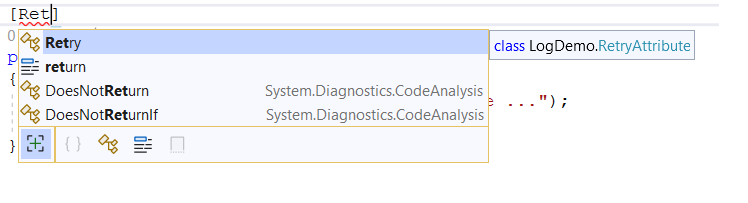
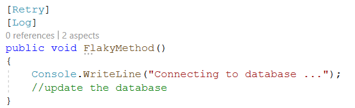

# Adding aspects to your code

Aspects are custom attributes that should be applied to a target declaration. Some aspects can target methods, while others can target properties or classes.

In this section, you will learn how to utilize custom attributes to add aspects.

## Adding aspects as custom attributes

Let's assume you have a method that fails occasionally.

Currently, CodeLens displays `No aspect`, indicating that no aspect has been applied to this method.

> [!NOTE]
> The CodeLens feature is only available in Visual Studio when Visual Studio Tools for Metalama and PostSharp are installed.

To apply the `Retry` aspect, add it as a standard custom attribute by typing `[Retry]`:

CodeLens now displays `1 aspect`. Hovering your cursor over that text will reveal the following tooltip:

To view the details, click on the text `1 aspect`:

The details displayed in this example are trivial. However, this feature can be quite useful when you have several aspects on the same method, or when aspects are implicitly applied rather than explicitly applied using a custom attribute.

## Adding more than one attribute

You can add as many aspects as you need to a target method. In this example, if you want to log each retry attempt, you can use the `Log` aspect.

CodeLens now shows that two aspects have been applied to the method `FlakyMethod`. Clicking on the text `2 aspects` allows you to view the details provided by CodeLens:

## Adding aspects via the refactoring menu

Instead of manually adding attributes, you can add them via the refactoring menu. This menu can be accessed by clicking on the _lightbulb_ or _screwdriver_ icon, or by pressing `Ctrl + .`.

As shown, the refactoring menu displays three different aspects that can be applied to this method. Hovering over a menu item will present a preview of your code with the aspect custom attribute.

The refactoring menu is smart enough to recognize which aspect has already been applied and adjusts the recommendations accordingly. The following screenshot shows that after applying the `Retry` aspect, the refactoring menu only displays the available but unused aspects.

> [!NOTE]
> The refactoring menu only displays aspects that are _eligible_ for your code. The eligibility of an aspect is determined by the aspect's author. For example, it wouldn't make sense to add a caching aspect to a method returning `void`, so the author of this aspect might make it eligible for non-void methods only.

> [!div class="see-also"]
> <xref:video-first-aspect>

