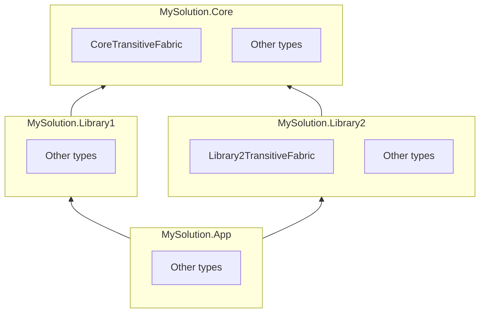

# Adding aspects to many aspects

If you have a repository or a solution composed of several projects, adding aspects from a central place is sometimes useful. This article explains several approaches.

Note that the same approaches also work when configuring aspect libraries or adding architecture rules.

## Using transitive project fabrics

_Transitive project fabrics_ are executed in any project that _references_ the assembly containing the fabric, either as a project or package reference.

### Execution order of transitive fabrics

Transitive project fabrics are executed after any _project fabric_ in the current project.

If several transitive project fabrics are active, they are executed in the following order:

1. Depth in the dependency graph: dependencies with lower depth (i.e., "nearer" to the main project) are processed first.

2. Assembly name (alphabetical order).

Transitive dependencies are intentionally executed after compilation dependencies, so compilation dependencies have a chance to configure transitive dependencies before they run.


### Example

So consider the following dependency graph:



In `MySolution`, the following transitive project fabrics will be active:

| Project | Active transitive project fabrics |
|--|--|
| `MySolution.Core` | None |
| `MySolution.Library1` | `CoreTransitiveFabric` |
| `MySolution.Library2` | `CoreTransitiveFabric` |
| `MySolution.App` | First `CoreTransitiveFabric`, then `Library2TransitiveFabric` |


## Using common project fabrics

A second approach is to rely on the directory structure instead of the dependency graph. 

The idea is to write a project fabric, store it in the root directory and the repo, and automatically include this file in each project using [Directory.Build.props](https://learn.microsoft.com/en-us/visualstudio/msbuild/customize-your-build).


#### Step 1. Create a project fabric

In the parent directory that recursively contains all projects you want to be affected by the shared fabric, create a project fabric deriving from <xref:Metalama.Framework.Fabrics.ProjectFabric> as you would do for a regular project fabric.

#### Step 2. Create Directory.Build.props

In the same directory, create a file named `Directory.Build.props` with the following content:

```xml
<Project>
	<!-- Imports Directory.Build.props of the upper directory. -->
	<Import Project="$([MSBuild]::GetPathOfFileAbove('Directory.Build.props', '$(MSBuildThisFileDirectory)../'))" 
			Condition="Exists('$([MSBuild]::GetPathOfFileAbove(`Directory.Build.props`, `$(MSBuildThisFileDirectory)../`))')"/>

	<!-- Include the shared fabric -->
	<ItemGroup>
        <Compile Include="$(MSBuildThisFileDirectory)SharedFabric.cs" />
    </ItemGroup>
</Project>
```

#### Example

See <xref:sample-shared-fabric>.

### Execution order of shared fabrics

 When you have several project fabrics in the same project, they are ordered by the following criteria:

1. Distance of the source file from the root directory: fabrics closer to the root directory are processed first.
2. Fabric namespace.
3. Fabric type name.

### Example

Suppose we have the following project structure:

```text

repo
+--- dir1
|     +-- subdir11
|     |   +-- Project11.csproj
|     |   +-- Project11Fabric.cs 
|     +-- subdir12
|         + Project12.csproj
+--- dir2
|    +-- subdir21
|    |    +-- Project21.csproj
|    +-- subdir22
|        +-- Project22.csproj
|        +-- Project21Fabric.cs
+-- SharedFabric.cs
+-- Directory.Build.props
```

Then the projects have the following fabrics:


| Project | Active transitive project fabrics |
|--|--|
| `Project11` | `SharedFabric`, `Project11Fabric` |
| `Project12` | `SharedFabric` |
| `Project21` | `SharedFabric` |
| `Project12` | `SharedFabric`, `Project21Fabric` |
