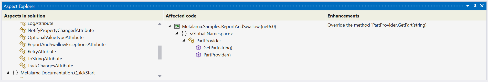

# Understanding your aspect-oriented code

Now that you have integrated aspects into your code, you might be curious about its functionality and execution process. Metalama provides several tools to help you understand precisely what happens with your code when you hit the Run button.

These tools include:

* CodeLens
* Metalama Diff
* Aspect Explorer

> [!NOTE]
> These features are only available in Visual Studio when Visual Studio Tools for Metalama and PostSharp are installed.

## CodeLens

The first tool that can assist you in understanding your code is CodeLens. This tool displays the number of aspects applied to your code directly in the editor. Clicking on the summary provides more details:

CodeLens reveals the following details:

|Detail | Purpose |
|-------|---------|
|Aspect Class  | The name of the aspect applied to this target. |
|Aspect Target | The fully qualified name of the target. |
|Aspect Origin | How the aspect is applied. |
|Transformation| A default message indicating that the aspect alters the behavior of the target method. |

The utility of this feature becomes apparent when you notice that many aspects can be added to your code and when aspects are applied implicitly. That is, even if there is no aspect custom attribute on your code, there may still be an aspect on it due to aspect inheritance (if the aspect has been applied to an ancestor class or interface) or fabrics (which allow adding aspects in bulk to code without custom attributes).

## Metalama Diff

Once you know that your code is being affected by some aspects, you might wonder how. The simplest way is to compare your source code with the generated code, side by side, in a diff. This is what Metalama Diff is about.

To preview the change, click on the `Preview Transformed Code` link in Code Lens.  Alternatively, you can right-click on the document, and choose _Metalama Diff_ in the document menu.

It will display the result as follows:

> [!NOTE]
> This preview dialog can also be accessed by pressing `Ctrl + K` followed by `0`.

The screenshot above displays the source of `FlakyMethod` and the code modified by the `[Log]` aspect. However, the command shows the entire file in its original and modified versions side by side.

To view changes for a specific section of the code, select that part of the code from the dropdown as shown below.

## Aspect Explorer

With CodeLens, you start from a specific piece of code, and you wonder which aspects it is influenced by.

Aspect Explorer answers the opposite question. It shows all aspects available in the current solution, and when you select one, it displays the declaration that it affects.

To open the Aspect Explorer tool window, use the top-level menu and select _Extension_ > _Metalama + PostSharp_ > _Aspect Explorer_.

> [!div class="see-also"]
> <xref:video-first-aspect>