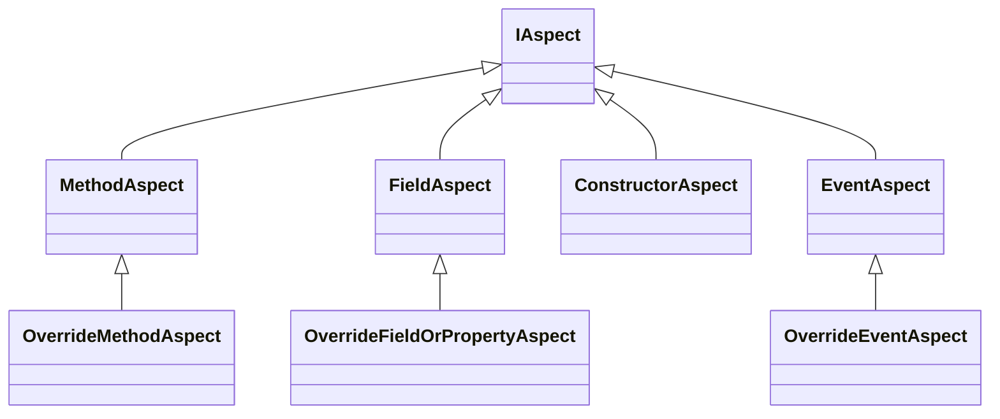

# Creating simple aspects 
You have seen how using aspects you can modify your program before it is compiled. In this chapter you shall learn how to create your own aspects targetting several parts of the code

## Different aspect types 
The following diagram shows the relationship between several types available in `Metalama.Framework.Aspects` namespace to create simple aspects easily. 

As you can see at the top there is the `IAspect` interface the is implemented across many different types to offer overriding functionality for different parts of the code. 

## What can aspects do 
An aspect can do the following thing

* _Transform_ a method
* _Modify_ a field or property
* _Introduce_ a property or a field 
* _Introduce_ a method 
* Offer coding fixes and diagonstics reporting 

Basically aspects are one of building blocks of Metalama. 

## Selection of Aspect type 
The following table summaries what aspect class you might need to build a simple aspect based on the target 

|Target | Aspect class | Purpose 
|-------|-------------|------------
| Method | `OverrideMethodAspect` | To override a target method 
| Field  | `OverrideFieldOrPropertyAspect` | To override the getter/setter of a field or property 
| Constructor | `ConstructorAspect` | To override a constructor  
| Events | `OverrideEventsAspect` | To override the target event  

## Overriding methods using aspects 

<xref:override-method-aspect> Details of method overriding 

