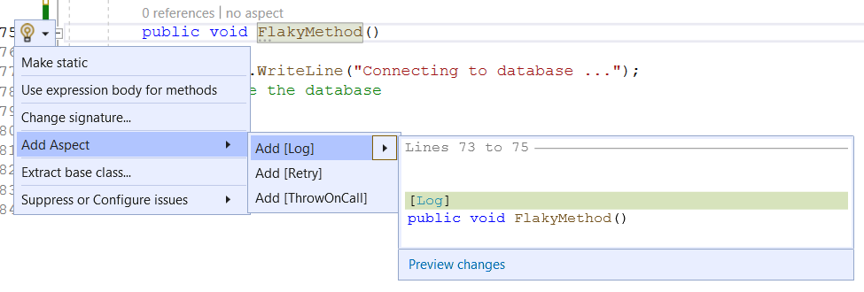

# Adding aspects via context-menu in Visual Studio 
Although you can add attributes manually, you can also see them via the context menu as shown below. 

Here the screenshot shows that there are three different aspects to be applicable on methods. Therefore the context menu shows the aspects and a preview of how the application will appear _if done_

This help is coming from Metalama Visual Studio Plugin. If you haven't got it installed. Follow the steps at <xref:get-metalama-vsx>

> [!NOTE]
> To enable the context menu, you have to click on the method name and move the cursor towards the left side of the editor and the lightbulb menu appears. 

The context menu is smart to know that which aspect has already been applied and it changes the recommendations accordingly. The following screenshot shows that after the application of the `Retry` aspect the context menu only shows the remaining aspects from the project 

