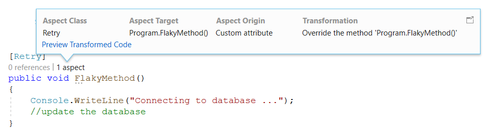
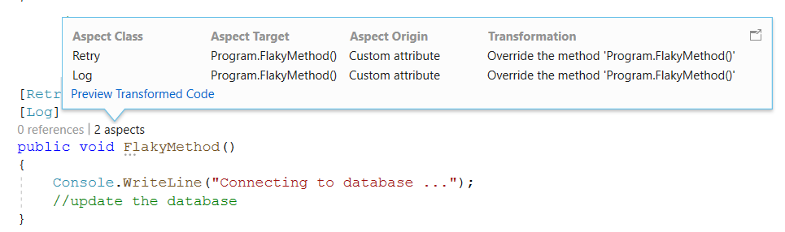

# Adding aspects using attribute
Aspects are attributes that have to be applied on the target. The target can be method. In this section you shall see how you can use the attribute to add the aspect. 

## Using a predefined aspect 
In previous section you saw how to create the `Logging` aspect and `Retry` aspect. Assume that you already have those two aspects added to your project. Now you should be ready to appply those on a method 

## Adding attribute 
To apply an aspect which is defined in `LogAttribute` on a method you have to apply the `[Log]` attribute on the target method 

Imagine you have  method like this that fails occassionally. 

CodeLense is showing that this method is not used anywhere and no aspect has yet been applied on this method. 

Now when you apply the `Retry` aspect you just have to add that as an attribute like this 

Once added then Visual Studio will show the method like this. 
When you hover your cursor on the text `1 aspect` it will show the message as shown below. 

The details provided by CodeLense can be explored further when you click on the text `1 aspect` On click it will show the following details 

## Adding more than one attribute
You can choose to use as many aspects as you need on a target method. In this example, you may want to log each retry attempt and then you have the option to use the `Log` aspect. 

> [!NOTE] 
> Notice that CodeLense now shows that there are two aspects being applied to this method `FlakyMethod` and if you click on the text `2 aspects` you can see the details as offered by CodeLense like this 

