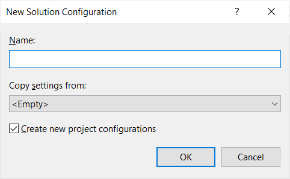

# Debugging aspect-oriented code

You have seen how aspects change your code and you have also seen the transformed code along with the original code side-by-side at <xref:preview-metalama-diff> 

In this section you shall see how to debug such code using tools you already use and love, the visual studio debugger. 

## Steps to debug aspect-oriented code 
Follow these steps to debug your code with aspects. 

### **Step 1** Open Build Configuration Manager
Click on the `Configuration Manager` from the debug setting dropdown as shown below 

### **Step 2** Create a debug configuration called `LamaDebug`
The configuration manager will present the following dialog. 

* Click to open the `Active solution configuration` dropdown. 

* Click on `<New...>` to create a new debug configuration. This will bring the New dialog as shown below. 

* Write the name **`LamaDebug`** and copy settings from `Debug` as shown below. 

* Save this configuration by clicking `OK` button 
* Now change the build configuration to `LamaDebug` 

Now you are ready to debug your aspect transformed code. 

> [!NOTE]
> When your breakpoint gets hit, notice that the code you are debugging is actually the transformed code.  