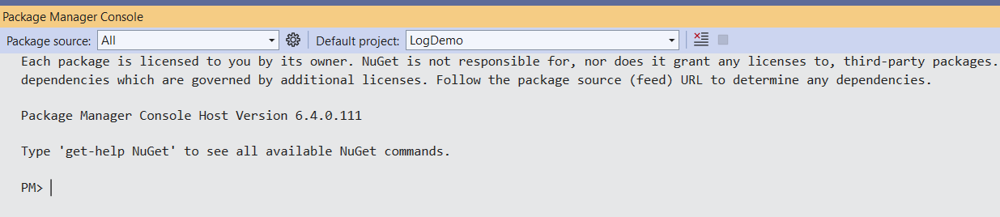

# Getting Metalama framework from Nuget
Only if you want to create your own custom aspect you shall need to get the Metalama package from Nuget. It is not needed if you just want to use some readymade aspects. 


>[!NOTE]
> Please note that Metalama works only for Visual Studio 2022 

You can find the latest and older releases on the [Nuget page](https://www.nuget.org/packages/Metalama.Framework)

## Installing Metalama package in Visual Studio 2022 

To install Metalama from the Nuget gallary use the following command at the Nuget Package Manager console. 

``` 
Install-Package Metalama.Framework -Version 2023.0.101-rc
```

**Step 1** Go to `Tools` -> `Nuget Package Manager` -> `Package Manager Console` 


**Step 2** This will present the `Package Manager Console` as shown below 



**Step 3** Write the following command  there on the prompt and hit `Enter` to install the latest release of Metalama 


Once installed you can see the details on the `Package Manager Console` and the `Solution Explorer` like this 


Congratulations! You are now ready to write your own custom aspects.  