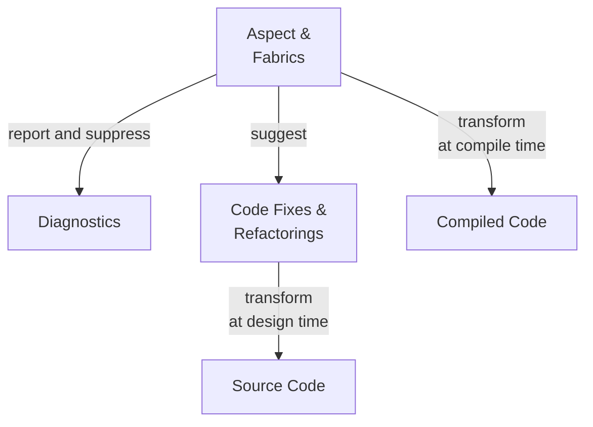

# Metalama Overview

> [!WARNING]
> This chapter has not been written yet.

The intent of this book, once written, will be to guide you through the evaluation of Metalama. It will not instruct you on how to deploy and use it, but rather why and if it is suitable for you.

## Features

Metalama possesses the following main features:

| Feature | Description |
|---------|-------------|
| __Aspect-Oriented Programming__ | This feature allows you to encapsulate repetitive patterns of code (such as logging, caching, INotifyPropertyChanged, multi-threading) into executable artifacts named _aspects_. These aspects add behaviors to your code at compile time, ensuring your source code remains clean and succinct - thus, easier to read and maintain.
| __Code Generation__             | This feature enables you to generate repetitive code, either in the editor or at compile time, instead of manually writing it. With Metalama, you can create your own code actions or refactorings that are readily available in the lightbulb or screwdriver menu.
| __Code Validation__             | This feature verifies that manually written code complies with team rules and conventions. Metalama allows you to report diagnostics (e.g., warnings or errors) or suppress source code diagnostics with ease.

