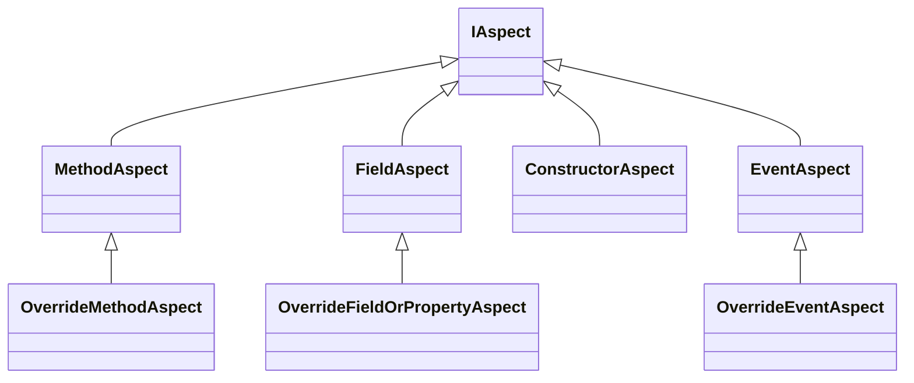

## Different types involved in aspect creation

The following diagram shows the relationship between several types available in the `Metalama.Framework.Aspects` namespace to create simple aspects easily.

## What can aspects do

## Selection of Aspect type

The following table summarizes what aspect class you might need to build a simple aspect based on your target

|Target | Aspect class | Purpose
|-------|-------------|------------
| Method | `OverrideMethodAspect` | To override a target method
| Field  | `OverrideFieldOrPropertyAspect` | To override a field or property getter/setter
| Constructor | `ConstructorAspect` | To override a constructor
| Events | `OverrideEventsAspect` | To override the target event

