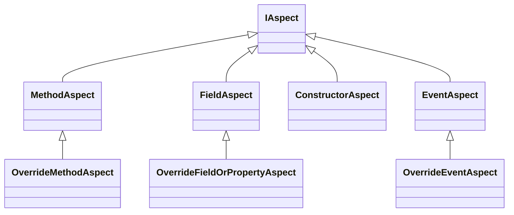

# Creating simple aspects

> ![WARNING]
> This chapter has not been written yet.

You have seen how aspects can modify your program before it is compiled. In this chapter you shall learn how to create your own aspects targeting several parts of the code

## Different aspect types

The diagram below shows the relationship between several types available in the `Metalama.Framework.Aspects` namespace to create simple aspects easily.

As you can see, the `IAspect` interface is implemented across many different types to deliver overrides for different parts of the code.

## What can aspects do

An aspect can do the following things:
* _Transform_ a method
* _Modify_ a field or property
* _Introduce_ a property or a field
* _Introduce_ a method
* Offer coding fixes and diagnostics reporting

Basically aspects are one of the building blocks of Metalama.

## Selection of Aspect type
The following table summarizes what aspect class you might need to build a simple aspect based on your target

|Target | Aspect class | Purpose
|-------|-------------|------------
| Method | `OverrideMethodAspect` | To override a target method
| Field  | `OverrideFieldOrPropertyAspect` | To override the getter/setter of a field or property
| Constructor | `ConstructorAspect` | To override a constructor
| Events | `OverrideEventsAspect` | To override the target event

## Overriding methods using aspects

<xref:override-method-aspect> | Details of method overriding

