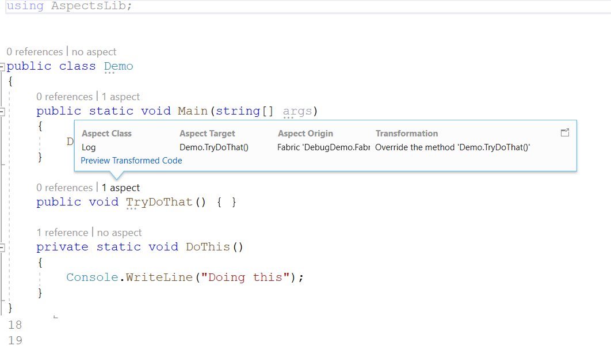

# Adding many aspects at once

In <xref:quickstart-adding-aspects>, you learned how to apply aspects one at a time using custom attributes. While this approach is appropriate for aspects like caching or auto-retry, it can be overwhelming for other aspects like logging or profiling.

In this article, you will learn how to use _fabrics_ to add aspects to your targets programmatically.

## Fabrics

_Fabrics_ are special classes in your code that execute at compile time, within the compiler, and at design time, within your IDE. Unlike aspects, fabrics do not need to be _applied_ to any declaration, nor do they need to be _called_ from anywhere. Their main method will be called at the right time just because it exists in your code.

Fabrics are really helpful when you need to add aspects to different targets programmatically.  

There are three different types of fabrics:

| Fabric type | Abstract class | Main method | Purpose
|------------|---------|--|--|
| Project Fabric| <xref:Metalama.Framework.Fabrics.ProjectFabric>  | <xref:Metalama.Framework.Fabrics.ProjectFabric.AmendProject*> | To add aspects to different declarations in the current project.
| Namespace Fabric| <xref:Metalama.Framework.Fabrics.NamespaceFabric>  | <xref:Metalama.Framework.Fabrics.NamespaceFabric.AmendNamespace*> | To add aspects to different declarations in the namespace that contains the fabric type.
| Type Fabric | <xref:Metalama.Framework.Fabrics.TypeFabric> | <xref:Metalama.Framework.Fabrics.TypeFabric.AmendType*> | To add aspects to different members of the type that contains the nested fabric type.

## Adding aspects using fabrics

To add aspects using fabrics:

1. Create a fabric class and derive it from <xref:Metalama.Framework.Fabrics.ProjectFabric>,  <xref:Metalama.Framework.Fabrics.NamespaceFabric>  or <xref:Metalama.Framework.Fabrics.TypeFabric>.

    > [!WARNING] 
    > Type fabrics must be nested classes and apply to their nesting type.
    > Namespace fabrics apply to their namespace.

2. Add an <xref:Metalama.Framework.Fabrics.TypeFabric.AmendType*>, <xref:Metalama.Framework.Fabrics.NamespaceFabric.AmendNamespace*> or <xref:Metalama.Framework.Fabrics.ProjectFabric.AmendProject*> method.

3. Call one of the following methods from <xref:Metalama.Framework.Fabrics.TypeFabric.AmendType*>, or

   * To select the type itself, simply use <xref:Metalama.Framework.Fabrics.IAmender`1.Outbound*?text=amender.Outbound> property.
   * To select type members (methods, fields, nested types, ...), call the <xref:Metalama.Framework.Aspects.IAspectReceiver`1.Select*> or <xref:Metalama.Framework.Aspects.IAspectReceiver`1.SelectMany*> method and provide a lambda expression that selects the relevant type members.


4. Call to the  <xref:Metalama.Framework.Aspects.IAspectReceiver`1.AddAspect*> method.

> [!NOTE]
> The <xref:Metalama.Framework.Fabrics.IAmender`1.Outbound*?text=amender.Outbound> method will not only select members declared in source code, but also members introduced by other aspects and that are unknown when your  <xref:Metalama.Framework.Fabrics.TypeFabric.AmendType*> method is executed. This is why the _Amend_ method does not directly expose the code model.


## Example: Adding aspect to all public methods of a type

In this section, you shall learn how to add `[Log]` attribute to all public methods of a given project.

To add aspect to all public methods add the following Fabric to your project.

```csharp

using Metalama.Framework.Aspects;
using Metalama.Framework.Fabrics;
using System;
using System.Linq;
using AspectsLib;

namespace Doc.ProjectFabric_
{
    internal class Fabric : ProjectFabric
    {
        public override void AmendProject(IProjectAmender project)
        {
            //Locating all types 
            var allTypes = project.Outbound.SelectMany
                            (p => p.Types);

            //Finding all public methods from all types
            var allPublicMethods = allTypes
                                    .SelectMany(t => t.Methods)
                                    .Where(z => z.Accessibility == Metalama.Framework.Code.Accessibility.Public);

            //Adding Log aspect 
            allPublicMethods.AddAspectIfEligible<LogAttribute>();
        }
    }
}
```

> [!NOTE]
> Fabrics need not be applied. They are triggered because of their presence in the project.

The following screenshot shows aspect application of this Fabric across all methods in the `Program.cs` file


> [!NOTE]
> Note that although there is no explicit attribute on the public methods of this type, you can see that all public methods `Main` and `TryDoThat` got the aspect applied.  

## Viewing applied aspects via CodeLense

CodeLense comes in particularly handy in such situations where you have to enquire about aspects and they are not present as an explicit attribute. To see which aspect got applied, click on the text `1 aspect` and you can see this



## Adding another aspect

(TODO)

To add another aspect you can add another Fabric. This time the Fabric will add the aspect `Retry` to all public methods that start with the word `Try`.

To do this add the following Fabric

```csharp

using System;
using System.Linq;
using AspectsLib;

namespace DebugDemo
{
    internal class Fabric2 : ProjectFabric
    {
        public override void AmendProject(IProjectAmender project)
        {
            //Locating all types 
            var allTypes = project.Outbound.SelectMany
                            (p => p.Types);

            //Finding all public methods from all types
            //that starts with the prefix "Try" 
            var allPublicMethods = allTypes
                                    .SelectMany(t => t.Methods)
                                    .Where(z => z.Accessibility == Metalama.Framework.Code.Accessibility.Public
                                         && z.Name.StartsWith("Try"));

            //Adding Log attribute 
            allPublicMethods.AddAspectIfEligible<RetryAttribute>();
        }
    }
}

```

After adding this Fabric to the project, it is expected to have 2 aspects (`[Log]` and `[Retry]`) on the method `TryDoThat`. The following screenshot proves that


> [!WARNING]
> Sometimes CodeLense misses the aspects to show. For that time it is required to rebuild the project.  
