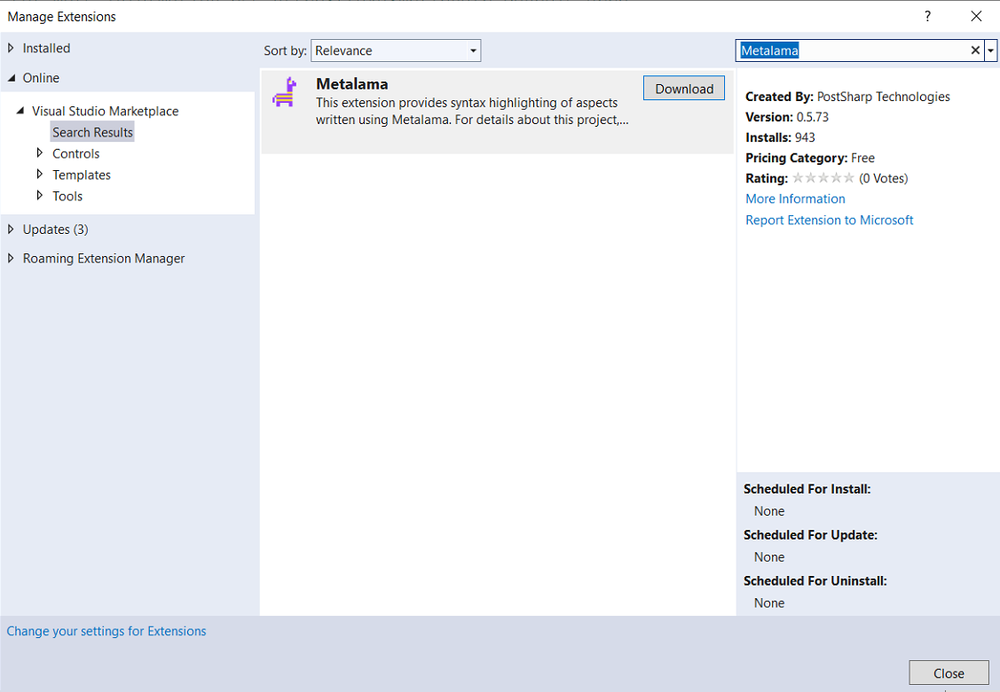
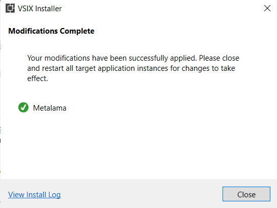

# Installing Metalama

The core features of Metalama are implemented in a set of NuGet packages and don't need to be installed on you machine. However, if you are working on a project that uses Metalama, it is a good idea to install Metalama Tools for Visual Studio.

## Adding the NuGet package to your project

If you are using existing aspects, all you have to do is to add a reference to the project or package defining these aspects, as with any other library. Metalama's main package, [Metalama.Framework](https://www.nuget.org/packages/Metalama.Framework), will come as a dependency.

For details of all NuGet packages and their dependencies, see <xref:packages>.

>[!NOTE]
>Metalama requires a target framework that supports .NET Standard 2.0.

## Installing Metalama Tools for Visual Studio

This extension helps you write aspects and understand your aspect-oriented code thanks to the following features:

* syntax highlighting of aspect codes (you will need it if you will be writing aspects later on),
* CodeLens additions,
* diffing your source code against the transformed code.

It is highly recommended that you download and install this extension for a better development experience. However, it is important to note that  this extension is optional and Metalama will work without it too.

> [!WARNING]
> This Metalama Visual Studio Plugin requires Visual Studio 2022

### **Step 1** : Go to `Extensions` > `Manage Extensions`

  

### **Step 2**: Click on `Manage Extensions`. This will show the prompt like this

  

### **Step 3**: Type "Metalama" in the searchbox to the right of this prompt as shown below  

  

### **Step 4**: Click the `Download` button to initiate the download

  

### **Step 5**: Once downloaded the extension will be ready to be installed

as soon as all instances of visual studio is closed. Note that this is highlighted
at the bottom of this screen.

  

### **Step 6**: Give consent to install the extension

As soon as you close the Visual Studio, the installer will start installing the extension.

The installer initializing

The installation wizard will work indepedently and will require your consent at the following stage

### **Step 7**: Click "Modify" to complete installation

To continue installing the extension, click on the `Modify` button. Once clicked the wizard will start installing the extension as shown below.

Finally, when the wizard is done installing it will show the result as shown below.

### Checking that the extension is installed

To check that the installation had been successfull go to the same visual studio marketplace again via the Extensions menu and then try to locate "Metalama". If the installation had been successful you should see the following screenshot with a green tick mark on the top right indicating that indeed the extension have been installed correctly!

## Installing Metalama Command-Line Tool it

Although you won't probably need it during your first days with Metalama, it's good to know what there a Metalama command-line tool exists. For details, see <xref:dotnet-tool>. No worry, we will remind you  when it when you will need it.
