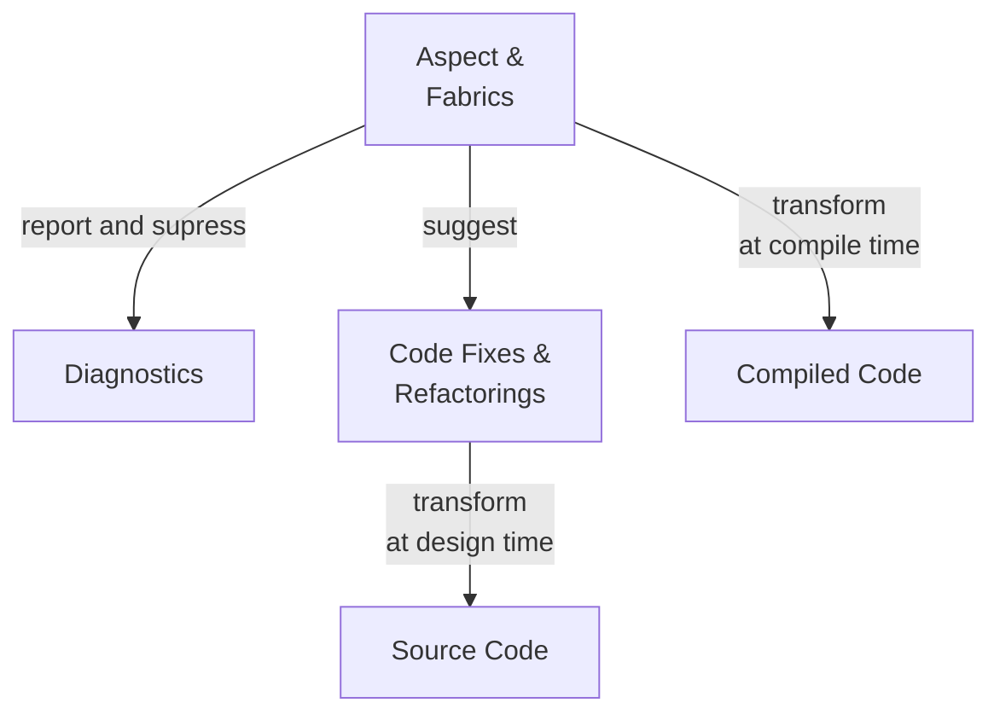

# Reviewer's Guide to Metalama

## Features

Metalama has the following principal features:

| Feature | Description |
|---------|-------------|
| __Aspect-Oriented Programming__ | Encapsulate repetitive patterns of code (such as logging, caching, INotifyPropertyChanged, multi-threading) into executable artifacts named _aspects_ that add behaviors to your code at compile time, so that your source code remains clean and succinct &mdash; easier to read and maintain.
| __Code Generation__             | Generate repetitive code, in the editor or at compile time, instead of writing it by hand. With Metalama, you can author your own code actions or refactorings that are available in the lightbulb or screwdriver menu.
| __Code Validation__             | Verify that hand-written code complies to team rules and conventions. Metalama lets you report diagnostics (e.g. warnings or errors) or suppress source code diagnostics simply.

