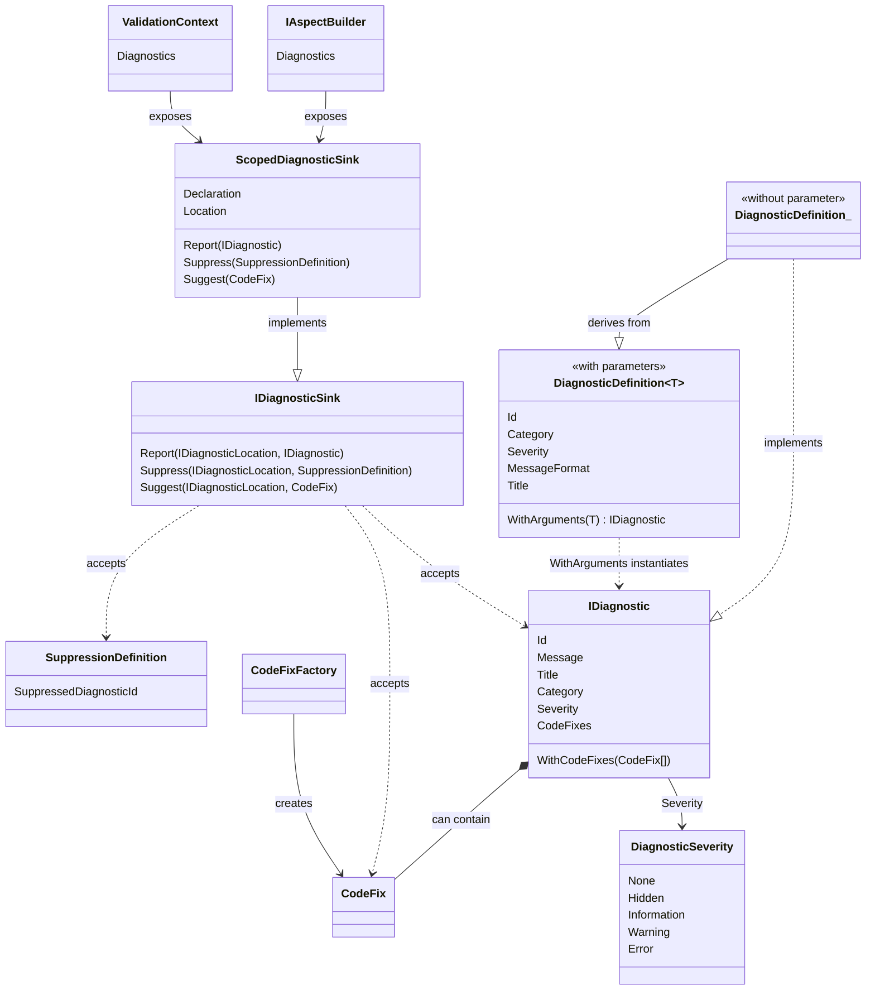

This is namespace allows you to report or suppress diagnostics from your aspect code.

## Conceptual Documentation

See <xref:diagnostics>.

## Class diagram

## Reporting diagnostics

To report a diagnostic, you must first define a static field of type <xref:Metalama.Framework.Diagnostics.DiagnosticDefinition> or 
<xref:Metalama.Framework.Diagnostics.DiagnosticDefinition`1> in your aspect class. The type <xref:Metalama.Framework.Diagnostics.DiagnosticDefinition> must be used for parameterless diagnostics, and <xref:Metalama.Framework.Diagnostics.DiagnosticDefinition`1> for parametric diagnostics.

To report a parametric diagnostics, you must first call the <xref:Metalama.Framework.Diagnostics.DiagnosticDefinition`1.WithArguments*> method. This step is not necessary with parameterless diagnostics.

To report a diagnostic, call the <xref:Metalama.Framework.Diagnostics.IDiagnosticSink.Report*> method. This object is exposed on the <xref:Metalama.Framework.Aspects.IAspectLayerBuilder.Diagnostics> property of the argument of the <xref:Metalama.Framework.Aspects.IAspectBuilder>.<xref:Metalama.Framework.Aspects.IAspect`1.BuildAspect*> method of your aspect. You can also report a diagnostic from a validator. 

When you are reporting a diagnostic, you can specify the *location* of the diagnostic, i.e. the element of code to which it will be reported (which determines the file and line of the error message). If you do not specify the location, the default location for the current context will be used.

You can add code fixes to diagnostics. For details, see the <xref:Metalama.Framework.CodeFixes> namespace.

## Suppressing diagnostics

To suppress of diagnostic, you must first define it as a static field of type <xref:Metalama.Framework.Diagnostics.SuppressionDefinition> in your aspect class.
You can then suppress a diagnostic from any declaration from an aspect using the 
<xref:Metalama.Framework.Diagnostics.IDiagnosticSink.Suppress*>
method.

For more information, see <xref:diagnostics>.

## Suggesting code actions

See <xref:Metalama.Framework.CodeFixes>.

## Namespace members