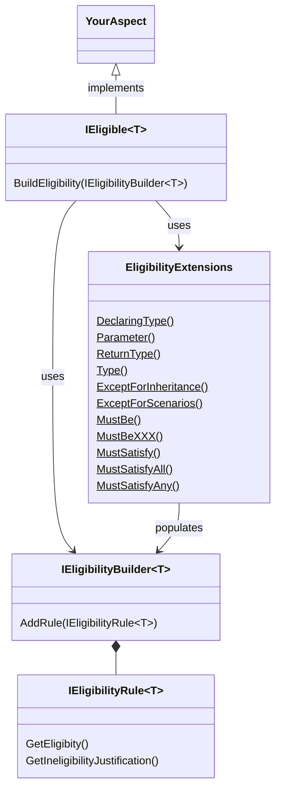

This is namespace allows you to define how your aspects can be used. 

## Conceptual Documentation

See <xref:eligibility>.

## Overview

Your aspect implements the <xref:Metalama.Framework.Eligibility.IEligible%601> interface, which has a single method <xref:Metalama.Framework.Eligibility.IEligible%601.BuildEligibility%2A>. This method receives an <xref:Metalama.Framework.Eligibility.IEligibilityBuilder%601>. Typically, you would use the extension methods of this interface defined in the <xref:Metalama.Framework.Eligibility.EligibilityExtensions> class to specify the eligibility of your aspect. These extension methods add predefined implementations of the <xref:Metalama.Framework.Eligibility.IEligibilityRule%601> interface to the <xref:Metalama.Framework.Eligibility.IEligibilityBuilder%601>. However, you can also provide your own implementation of the <xref:Metalama.Framework.Eligibility.IEligibilityRule%601> interface.

For details and examples, see <xref:eligibility>.

## Class diagram

## Namespace members