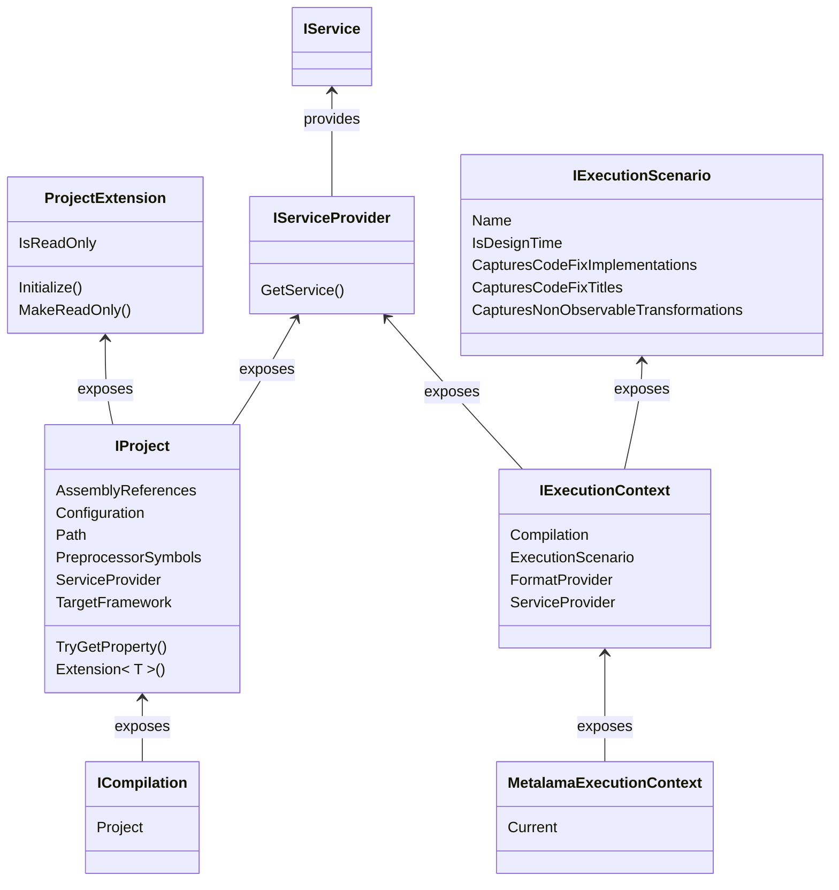

This namespace fulfills the following purposes:

* Gives read access to the project configuration, which includes the project references, preprocessor symbols, build properties, and other similar pieces of information. See the <xref:Metalama.Framework.Project.IProject> interface for details. This interface is accessible from any code element through the <xref:Metalama.Framework.Code.ICompilation.Project?text=ICompilation.Project> property.

* Allows you to implement a configuration API for your aspect library. See <xref:exposing-configuration> for details.

* Exposes information about the current execution context on the <xref:Metalama.Framework.Project.MetalamaExecutionContext.Current?text=MetalamaExecutionContext.Current> property.
  
* Exposes the service provider, which gives access from high-level code to the low-level plug-ins.

## Conceptual documentation

See <xref:exposing-configuration>.

## Class diagram

## Namespace members