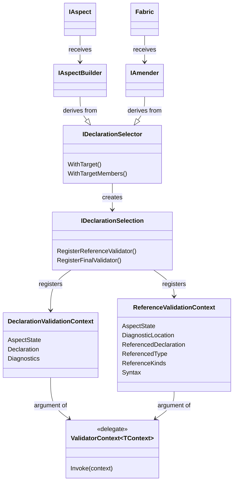

This is namespace allows you to validate your code, the code that uses your aspects, or the code that references the code that uses your aspects.

Validators execute _after_ all aspects have been applied to the compilation. To validate whether an aspect is eligible for a declaration (which involves validating the compilation _before_ the aspect has been applied), implement the <xref:Metalama.Framework.Eligibility.IEligible%601.BuildEligibility%2A> aspect method.

Aspect can register validators from their implementation of <xref:Metalama.Framework.Aspects.IAspect%601.BuildAspect%2A?text=IAspect.BuildAspect>, and fabrics from their implementation of <xref:Metalama.Framework.Fabrics.TypeFabric.AmendType%2A>, <xref:Metalama.Framework.Fabrics.NamespaceFabric.AmendNamespace%2A> or <xref:Metalama.Framework.Fabrics.ProjectFabric.AmendProject%2A>. From these methods, call the <xref:Metalama.Framework.Aspects.IDeclarationSelector%601.WithTargetMembers%2A?text=amender.WithTargetMembers> or <xref:Metalama.Framework.Aspects.IDeclarationSelector%601.WithTarget%2A?text=amender.WithTarget> method exposed on the `builder` or `amender` parameter, then call `RegisterFinalValidator` or `RegisterReferenceValidator`. These methods allow you to register a delegate. This delegate is then called and receive a context object of type <xref:Metalama.Framework.Validation.DeclarationValidationContext> or <xref:Metalama.Framework.Validation.ReferenceValidationContext>. The delegate can then analyze the code or reference, and report diagnostics.

## Class Diagram

## Namespace Members