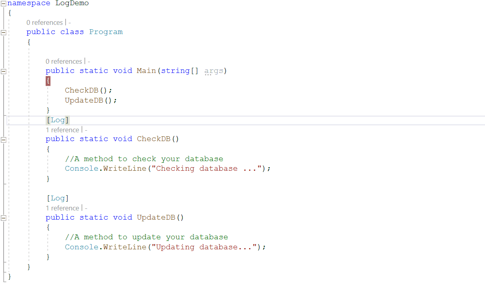

# Introduction to Metalama

## Introduction
The world of programming used to be simple. But not anymore. It is impossible to expect human experts to know details of a system let alone getting it right always. 

Meta programming is programming to understand, modify and enhance the behaviour of other progarms. _Metalama_ is the framework that lets you do all of these very easily. 
You shall experience those for yourself here.


As a tech lead or senior developer you have always wanted 
* To <span style="color: green;">**_reduce_**</span> duplicate coding effort 
* To  <span style="color: green;">**_ensure_**</span> code quality across the organization 
* To  <span style="color: green;">**_offer_**</span> coding <span style="color: green;">**_assistance_**</span> to junior developers! 

Metalama has three major offerings. It can do the following for you and your team. 
**Metalama** can help with all of that. It can 
 
* Help remove boilerplate code 
  * Thereby _reducing duplicate effort_ 
* Can _ensure code quality_ and standard are followed
  * it prevents architectural decay
* Offer predefined code snippets
  * So developers can just use the right and tested implementation always via _coding assistance_ provided by the IDE menus.

In this chapter you shall see demos of these capabilities that Metalama has to offer. But before that let's go a bit deep around the architecture of Metalama itself. 

## Architecture of Metalama 
Metalama is written using Roslyn. The following diagram shows the building blocks of Metalama. 


## What can Metalama do for you
The following demos showcase capabibilities of Metalamana. However this is just the proverbial _tip-of-the iceberg_. With Metalama you can do lot more than these. 

### Demo 1 : Easy Logging (Boilerplate reduction)
Assume that you are working on a big codebase and a bug has been reported. You have to go to all the different method calls to find the call that is causing the problem. One common way to fix this is to add logging to all the functions. As you can imagine that it will be lot of boilerplate code to add and then remove once the fix gets identified. 

The solution Metalama produces is to add an attribute to your functions and they will start logging calls to them automatically. (Well it seems so! But there has been considerable amount of work done to make it happen.)

Imagine you have the following code 

```csharp

void updateDB(){

}

void checkDB(){

}
```

[!INCLUDE [Create log demo project](log_demo_create_proj.md)]

Change the program to 

[!code-csharp[](logDemo.cs)]

When executed this code produces the following output

<pre>
Checking database ...
Updating database...
</pre>

There is no surprise in this. But with Metalama you can just add an attribute like this on top of the methods and it will log the methods. The lines are highlighted below. 

[!code-csharp[](logDemo.cs?highlight=17,24)]

This will generate the following output when executed

<pre>
Entering Program.CheckDB()
Checking database ...
Method Program.CheckDB() executed successfully
Exiting Program.CheckDB()
Entering Program.UpdateDB()
Updating database...
Method Program.UpdateDB() executed successfully
Exiting Program.UpdateDB()
</pre>

You may be wondering where from did extra lines come from? They came from the attribute `Log` used. 

You shall later learn how to create your own custom attributes or aspects as they are called. But for now see the following screen recording showing the aspect in action.




     
### Demo 2 : Validate method is used in Test namespace (Architecture validation)


### Demo 3 : LiveTemplate example : ToString example. (Assisted/Guided coding) 

