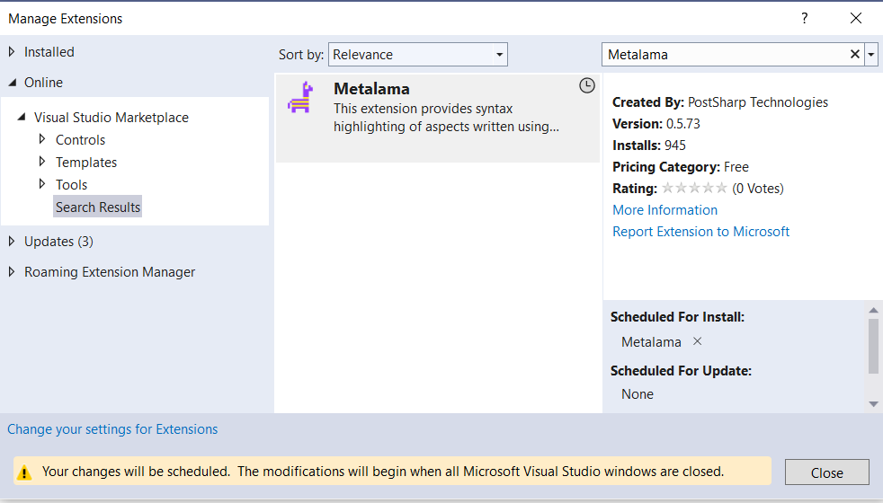

# Getting started using aspects
If you are programming a few years, you obviously noticed several ways your 
programs grow and reach out of bounds. So it becomes increasingly difficult to 
take care of them and scale them properly. Since there had been no support in the .NET languages to templatize recurring design patterns, it becomes impossible to get rid of so-called boilerplate codes programmatically. 
Granted, you can create reusable code in functions and types but then eventually your 
code will be spinkled with such code calls. 

Also, in green-field projects as an architect or team lead you start with a vision for code quality and architure best practices that you want to follow. However over time other commitments and duties like shipping before deadline and within budget becomes the priority. This results in huge technical-debt accumulated over time. I bet you wished for some magical thing that could help you stay on track for your architectural vision and prevent the so called architural-erosion from happening; so that you can not only ship good code on time but stay ready for obvious future enhancements that are already on your way! 

Aspect oritented programming a.k.a [AOP](https://en.wikipedia.org/wiki/Aspect-oriented_programming) can help you in these situations and many more. This guide is written to aquaint you to the process of using aspects created using "Metalama" the world leading aspect oriented programming framework for C# and the best Visual Studio Plugin for 
AOP. 

### Objective
The objective of this guide is to get you started using the benefits of Metalama using the Metalama Visual Studio Extension. By the end of this guide

* You would know what is an aspect and how can it help you 
* You should understand how to use Metalama Visual Studio Extension
* You shall be in a position to advocate usage of more aspects 

### What’s an Aspect? 
An aspect is a programming block that changes the behaviour of a system by attributing different capabilities that the original program lacked _at runtime_. The part of the original program on top of which the aspect is applied is called `Target`

A target can be *anything* inside a code block
For example, it can be 

* A class 
* A method 
* A parameter 


### Why I need one? 
An aspect can help you in multitude of situations. However all of these can be broadly classified under three different broad categories. 

* _Boilerplate Reduction_ 
     * No need to write the same thing over and over again to be used in different locations in the code. 
* _Code Generation_ 
     * Generate code that is needed but not necessarily business code automatically
	 everytime you need it.
* _Preventing Architectural Decay_
    * Prevent bad quality code check-ins by enforcing your coding standard via aspects 
	and other related tools like fabrics. 
	
The following sections tries to go a bit deeper along each of this areas of applications. 


#### Boilerplate reduction
* Logging (ex: Creating aspect to log details automatically)
* Caching 
* Parallizing function calls 
* Interface auto-implementation 

#### Code Generation 
* Introduce new properties (Introduce new properties) 
* Introduce new methods 

#### Preventing Architectural Decay
* Create code analyzers for several situations (detect code-smells)
* Create code fixers for several situations (And fix them as you see fit)


### Getting Metalama Visual Studio Extension 
You can easily download and install Metalama Visual Studio Extension from Visual Studio marketplace by the following steps 

#### **Step 1** : Go to `Extensions` > `Manage Extensions` 

  

#### **Step 2**: Click on `Manage Extensions`. This will show the prompt like this

  

#### **Step 3**: Type "Metalama" in the searchbox to the right of this prompt as shown below.  

  


#### **Step 4**: Click the `Download` button to initiate the download.

  


#### **Step 5**: Once downloaded the extension will be ready to be installed 
as soon as all instances of visual studio is closed. 

> [!NOTE]
> This is highlighted at the bottom of this screen. 

  

#### **Step 6**: Give consent to install the extension 
As soon as you close the Visual Studio, the installer will start installing the extension. 


The installer initializing 


The installation wizard will work indepedently and will require your consent at the following stage 


#### **Step 7**: Click "Modify" to complete installation 
To continue installing the extension, click on the `Modify` button. Once clicked the wizard will start installing the extension as shown below. 

 


> [!NOTE]
> :eyes: The extension is only supported for Visual Studio 2022 edition.

Finally, when the wizard is done installing it will show the result as shown below. 


 
### Checking installation from Visual Studio
To check that the installation had been successfull go to the same visual studio marketplace again via the Extensions menu and then try to locate "Metalama". If the installation had been successfull you should see the following screenshot with a green tick mark on the top right indicating that indeed the extension have been installed correctly!


### Meet your first aspect 

#### The situation 
Let's imagine a situation. You have many different method calls in a particular section of the code and you are not getting it to work. Somewhere the call chain breaks. The only way to track this is to put tracing logs at the entry and exit of each method calls and then try to read through the generated log to see if it works or not. But to achieve this you shall have to write trace-logging code at each and every method and function body. That's hard to the say the least. It is downright prohibitive if the number of involved methods are more than just a handful. 

Imagine you have the following method to update a database. 

```csharp
public bool UpdateDatabase(ItemDetails details)
{
   //checking if it is ok to update 
   bool ok = dbInstance.CheckConditions();
   //
   if (ok)
   {
	   UpdateCore(details);
   }
   //Updating the status that the update was successfull 
   UpdateStatus(details.Id);
}

```

#### The solution 
Now imagine that this method is broken and you need to do a continuity check. I bet you thought to yourself that if you had a magical way to log every step of the process at least on the function call level then it would have been much easier to debug. 

##### Getting Metalama framework (via Nuget)
To design an aspect you need the Metalama framework. You can download the same from Nuget. The following screenshot shows a glimpse of the Nuget page of Metalama 


The nuget is located at https://www.nuget.org/packages/Metalama.Framework

##### Creating your first aspect 

Before getting started to create your first aspect install the nuget package. 
To install the nuget package, go to `Tools` -> `Nuget Package Manager` -> `Package Manager Console`
then issue the following command on the `Package Manager Console` as shown below 


To create the aspect create a class inside your project. called `LogAttribute.cs` 

Then in the `LogAttribute.cs` file add the following code.  
The following shows probably the simplest possible aspect you shall ever see. 
You can consider this as the "Hello World" example of AOP. 

```csharp

using Metalama.Framework.Aspects;
using System;
using System.Collections.Generic;
using System.Linq;
using System.Text;
using System.Threading.Tasks;

namespace MetaLamaEx
{
    public class LogAttribute : OverrideMethodAspect
    {
        public override dynamic OverrideMethod()
        {
            string methodName = meta.Target.Method.ToDisplayString();

            Console.WriteLine($"Entering {methodName}");
            try
            {
                var result = meta.Proceed();
                Console.WriteLine($"Exiting {methodName}");
                return result;
            }
            catch ( Exception ex )
            {
                throw ex;
            }
        }
    }
}

```

> [!NOTE]
> The namespace `Metalama.Framework.Aspects` must be imported. 

Metalama extension uses a color scheme to help you write code that will compile at design and at runtime. The code will be rendered as follows 

  
:::image type="content" source="images/first_aspect.png" alt-text="alt text":::

> [!NOTE]
> :eyes: Notice how the color of `meta.Target` and `meta.Proceed()` are different from the rest. 

|Part | _Visual Representation_ |
|-----|---------------|
|`meta.Target`||
|`meta.Proceed()`||

##### Using the aspect 

> "Applying an aspect means <span style="color: red;">**_attributing_**</span> a type or parts of a type with _a <span style="color: green;"> **_behvavior_**</span> 
that was not originally present. In C# and Metalama this is done by writing the name of the aspect as an attribute on top of the type or on top of the part on which it has to be applied." 

The following code snippet shows how this newly created _aspect_ can be applied as an attribute on methods (`target` of the aspect is method in this case) 


```csharp
[Log]
public bool UpdateDatabase(ItemDetails details)
{
   //checking if it is ok to update 
   bool ok = dbInstance.CheckConditions();
   //
   if (ok)
   {
	   UpdateCore(details);
   }
   //Updating the status that the update was successfull 
   UpdateStatus(details.Id);
}


[Log]
public void UpdateCore(ItemDetails details)
{ 
   
}

[Log]
public void UpdateStatus(ItemDetails details)
{ 

}


```

On a sample run the above code will emit this type of result 
because the value of `ok` could have been false. 

```
Entering UpdateDatabase
Entering UpdateStatus 
Exiting UpdateStatus
Exiting UpdateDatabase
```

another sample run might yeild the following result where `ok` was `true`

```
Entering UpdateDatabase
Entering UpdateCore
Exiting UpdateCore
Entering UpdateStatus 
Exiting UpdateStatus
Exiting UpdateDatabase
```

So you can see how easy it becomes to enable method level logging capability 
across your application using simple atrributes. It has many advantages which you may well have spotted. But in a nutshell,

#### Advantages 

- You **DON'T**  need to change the business code to add certain behaviour 
- You can **toggle** the **behaviour** easily 
- The facility/behaviour attributed is **absolutely decoupled** from the `Target` 

### Interacting with Code Lense

#### Locating aspects 

#### Finding details

#### Seeing it in action

