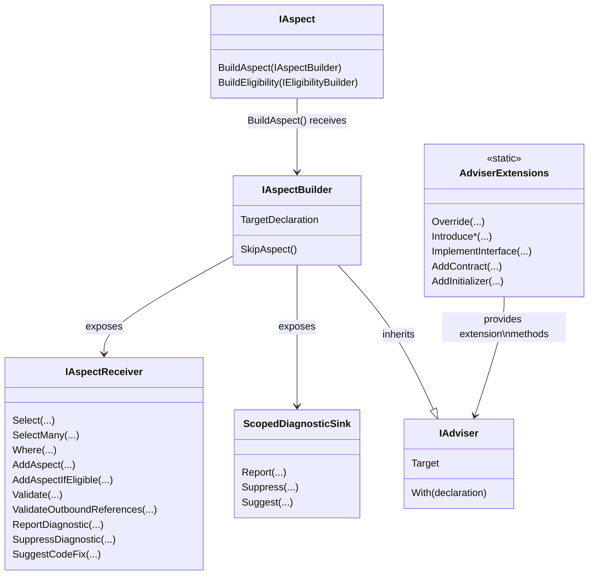
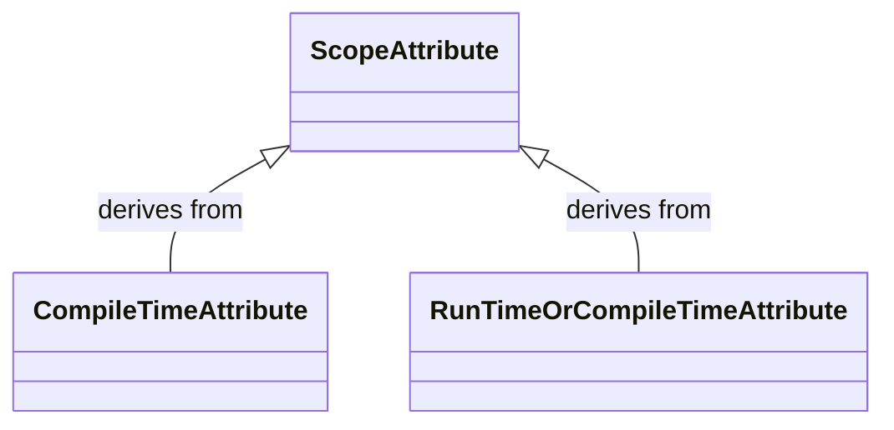
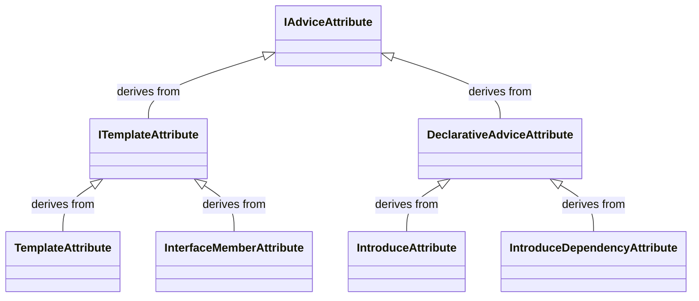
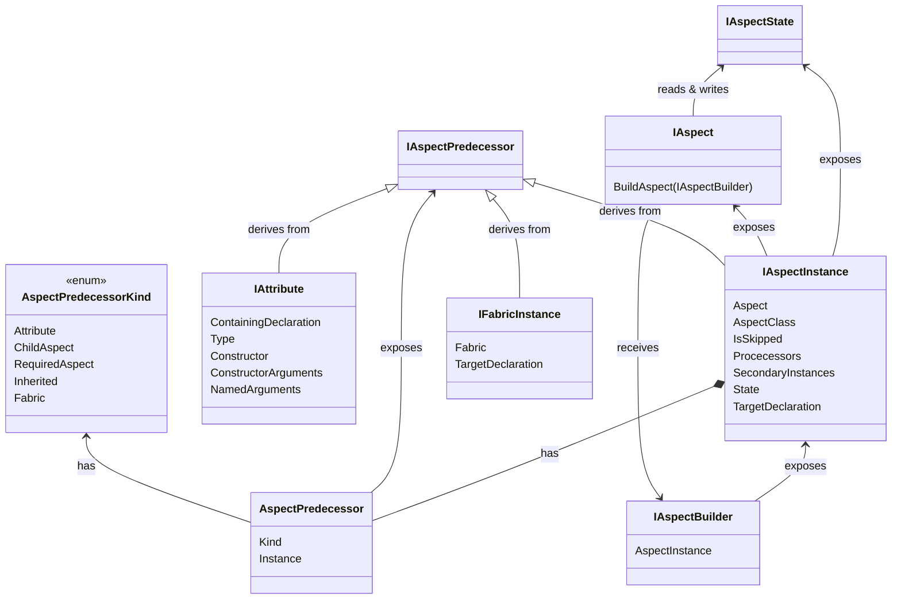

This namespace enables you to build aspects. Aspects represent an algorithmic approach to code transformation or validation.

For instance, tasks such as adding logging to a method or implementing `INotifyPropertyChanged` can largely be expressed as an algorithm and, therefore, implemented as an aspect.

## Conceptual Documentation

Refer to <xref:aspects> for more information.

## Overview

To create an aspect, you need to create a class that derives from <xref:System.Attribute> and implement the <xref:Metalama.Framework.Aspects.IAspect`1> interface. Alternatively, you can use one of the following classes, which already derive from <xref:System.Attribute>, have the appropriate <xref:System.AttributeUsageAttribute>, and implement the <xref:Metalama.Framework.Aspects.IAspect`1> interface:

* <xref:Metalama.Framework.Aspects.CompilationAspect>
* <xref:Metalama.Framework.Aspects.ConstructorAspect>
* <xref:Metalama.Framework.Aspects.EventAspect>
* <xref:Metalama.Framework.Aspects.FieldAspect>
* <xref:Metalama.Framework.Aspects.FieldOrPropertyAspect>
* <xref:Metalama.Framework.Aspects.MethodAspect>
* <xref:Metalama.Framework.Aspects.ParameterAspect>
* <xref:Metalama.Framework.Aspects.PropertyAspect>
* <xref:Metalama.Framework.Aspects.TypeAspect>
* <xref:Metalama.Framework.Aspects.TypeParameterAspect>

## Class Diagrams

### Aspect builders

### Scope custom attributes

### Advice and template attributes

### IAspectInstance, IAspectPredecessor

The <xref:Metalama.Framework.Aspects.IAspectPredecessor> facility allows aspects to access their parent (i.e. the artifact that created them): a parent aspect, a fabric, or a custom attribute.

## Namespace members
