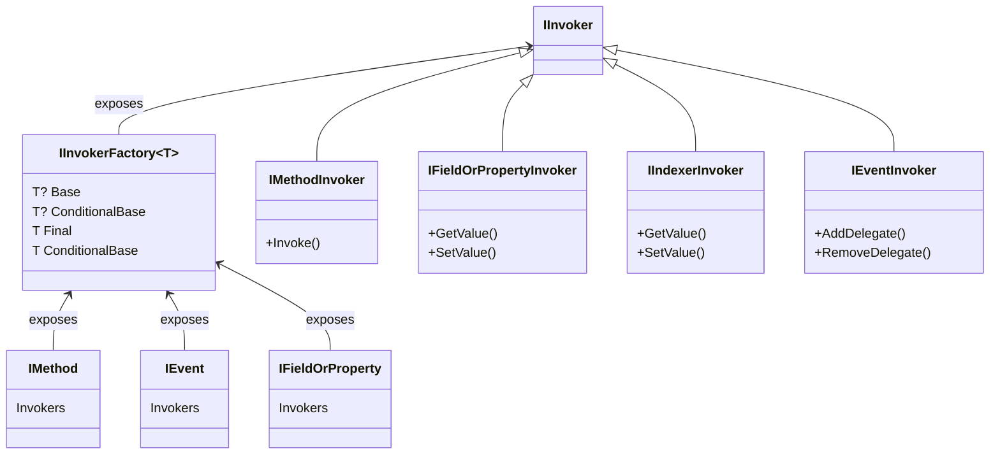

This namespace defines invokers, which are objects that generate syntax that invokes methods or accesses properties, fields or events.

Where it makes sense, declarations expose an invoker factory (<xref:Metalama.Framework.Code.Invokers.IInvokerFactory`1>) on their `Invokers` property. 
The invoker factory interface has two properties:

-  <xref:Metalama.Framework.Code.Invokers.IInvokerFactory`1.Final> is equivalent to the `this` keyword in C#. It allows you to access the last override
   of the semantic.

-  <xref:Metalama.Framework.Code.Invokers.IInvokerFactory`1.Base> is equivalent to the `base` keyword in C#. It allows you to access the implementation
   prior to the current aspect layer.

-  <xref:Metalama.Framework.Code.Invokers.IInvokerFactory`1.ConditionalFinal> and <xref:Metalama.Framework.Code.Invokers.IInvokerFactory`1.ConditionalBase> generate a `.?` null-conditional access instead of `.`.

## Class Diagram

## Example

The following aspect prints the value of all fields and automatic properties.

[!metalama-sample  ~/code/Metalama.Documentation.SampleCode.AspectFramework/PrintFieldValues.cs name="Dynamic"]

## Namespace members