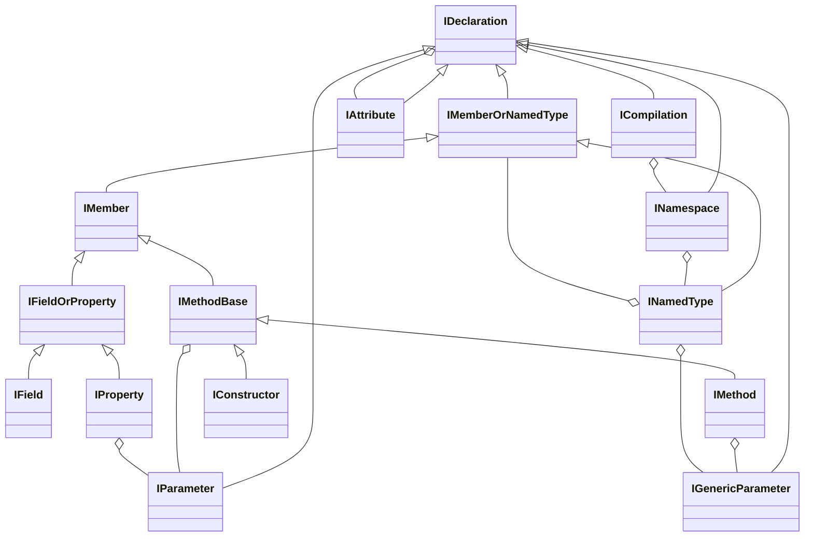

This namespace encompasses the representation of both the source code and the transformed code.

## Simplified class diagram

```mermaid
classDiagram
      IDeclaration <|-- IMemberOrNamedType
      IMemberOrNamedType <|-- IMember
      IMemberOrNamedType <|-- INamedType
      IMember <|-- IFieldOrProperty
      IFieldOrProperty <|-- IField
      IFieldOrProperty <|-- IProperty
      IMember <|-- IMethodBase
      IMethodBase <|-- IMethod
      IMethodBase <|-- IConstructor
      IDeclaration <|-- IParameter
      IDeclaration <|-- IGenericParameter
      IDeclaration <|-- IAttribute
      IDeclaration <|-- INamespace
      IDeclaration <|-- ICompilation


      IMethodBase o-- IParameter
      IProperty o-- IParameter
      IDeclaration o-- IAttribute
      IMethod o-- IGenericParameter
      INamedType o-- IGenericParameter
      INamedType o-- IMemberOrNamedType
      ICompilation o-- INamespace
      INamespace o-- INamedType
```

