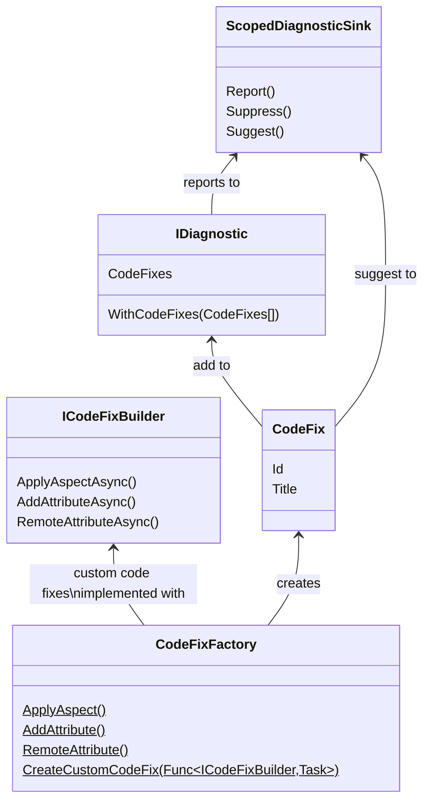

This namespace enables you to suggest code fixes and code refactorings, which are changes to source code that appear in the lightbulb or screwdriver menu of your IDE.

You can instantiate code fixes using the static methods of the <xref:Metalama.Framework.CodeFixes.CodeFixFactory> class.

To add code fixes to a diagnostic, utilize the <xref:Metalama.Framework.Diagnostics.IDiagnostic.WithCodeFixes*?text=IDiagnostic.WithCodeFixes> method.

To suggest a code refactoring without reporting a diagnostic, employ the <xref:Metalama.Framework.Diagnostics.ScopedDiagnosticSink.Suggest*>text=ScopedDiagnosticSink.Suggest> method.

## Class diagram

## Namespace members
