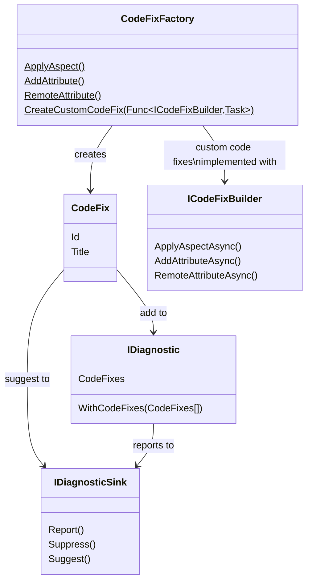

This namespace allows you to suggest code fixes and code refactorings, i.e. changes to source code that appear in the lightbulb or screwdriver menu of your IDE.

Code fixes can be instantiated using the static methods of the <xref:Metalama.Framework.CodeFixes.CodeFixFactory> class.

To add code fixes to a diagnostic, use the <xref:Metalama.Framework.Diagnostics.IDiagnostic.WithCodeFixes*?text=IDiagnostic.WithCodeFixes> method.

To suggest a code refactoring without reporting a diagnostic, use the <xref:Metalama.Framework.Diagnostics.IDiagnosticSink.Suggest*>text=IDiagnosticSink.Suggest> method.

## Class diagram

## Namespace members