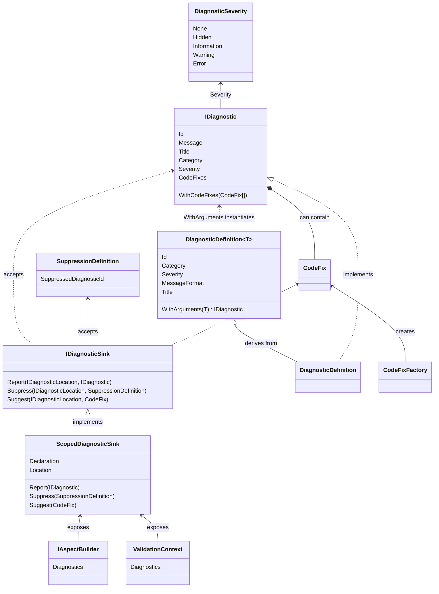

This namespace allows you to report or suppress diagnostics from your aspect code.

## Conceptual Documentation

Refer to <xref:diagnostics>.

## Class diagram

## Reporting diagnostics

To report a diagnostic, first define a static field of type <xref:Metalama.Framework.Diagnostics.DiagnosticDefinition> or <xref:Metalama.Framework.Diagnostics.DiagnosticDefinition`1> in your aspect class. Use <xref:Metalama.Framework.Diagnostics.DiagnosticDefinition> for parameterless diagnostics, and <xref:Metalama.Framework.Diagnostics.DiagnosticDefinition`1> for parametric diagnostics.

To report parametric diagnostics, first call the <xref:Metalama.Framework.Diagnostics.DiagnosticDefinition`1.WithArguments*> method. This step is not necessary for parameterless diagnostics.

To report a diagnostic, call the <xref:Metalama.Framework.Diagnostics.IDiagnosticSink.Report*> method. This object is exposed on the <xref:Metalama.Framework.Aspects.IAspectBuilder.Diagnostics> property of the argument of the <xref:Metalama.Framework.Aspects.IAspectBuilder>.<xref:Metalama.Framework.Aspects.IAspect`1.BuildAspect*> method of your aspect. You can also report a diagnostic from a validator.

When reporting a diagnostic, you can specify the *location* of the diagnostic, i.e., the code element to which it will be reported (which determines the file and line of the error message). If you don't specify the location, the default location for the current context will be used.

You can add code fixes to diagnostics. For details, refer to the <xref:Metalama.Framework.CodeFixes> namespace.

## Suppressing diagnostics

To suppress a diagnostic, first define it as a static field of type <xref:Metalama.Framework.Diagnostics.SuppressionDefinition> in your aspect class.
You can then suppress a diagnostic from any declaration from an aspect using the <xref:Metalama.Framework.Diagnostics.IDiagnosticSink.Suppress*> method.

For more information, refer to <xref:diagnostics>.

## Suggesting code actions

Refer to <xref:Metalama.Framework.CodeFixes>.

## Namespace members
