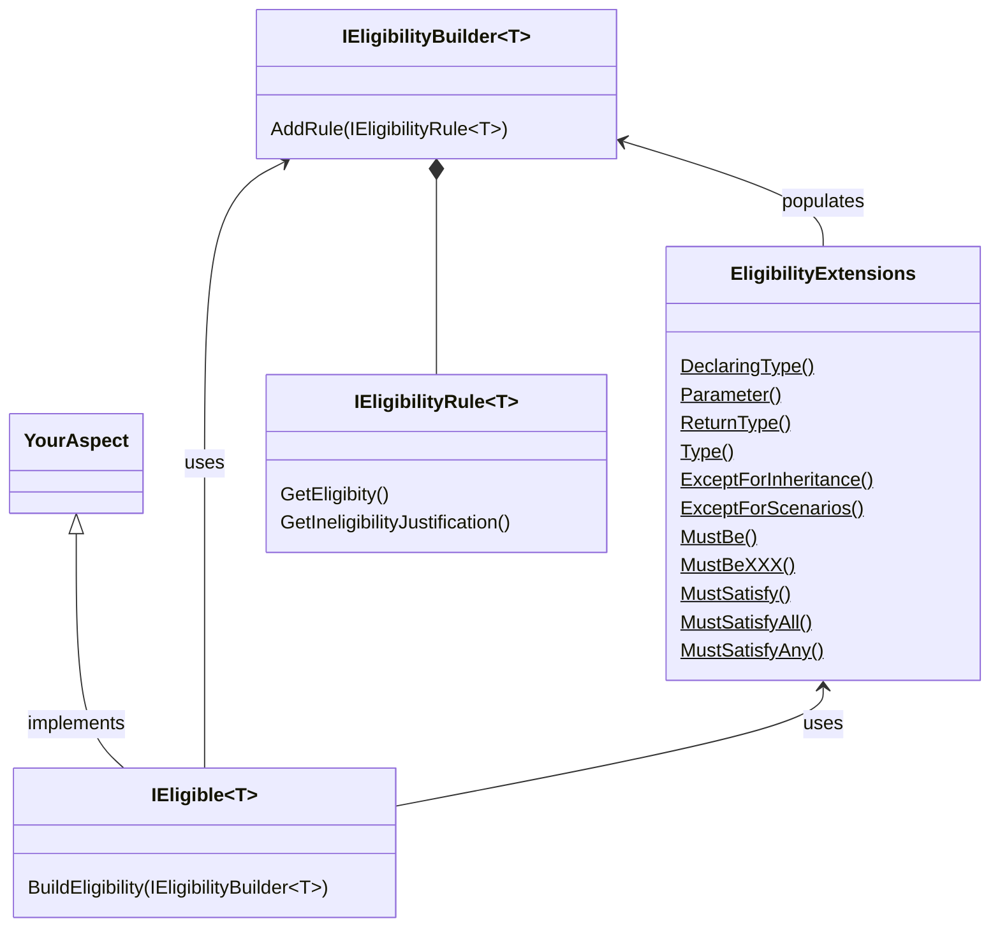

This namespace allows you to define how your aspects can be utilized.

## Conceptual Documentation

Refer to <xref:eligibility>.

## Overview

Your aspect should implement the <xref:Metalama.Framework.Eligibility.IEligible`1> interface, which contains a single method, <xref:Metalama.Framework.Eligibility.IEligible`1.BuildEligibility*>. This method receives an <xref:Metalama.Framework.Eligibility.IEligibilityBuilder`1>. Typically, you would use the extension methods of this interface defined in the <xref:Metalama.Framework.Eligibility.EligibilityExtensions> class to specify the eligibility of your aspect. These extension methods add predefined implementations of the <xref:Metalama.Framework.Eligibility.IEligibilityRule`1> interface to the <xref:Metalama.Framework.Eligibility.IEligibilityBuilder`1>. However, you also have the option to provide your own implementation of the <xref:Metalama.Framework.Eligibility.IEligibilityRule`1> interface.

For more details and examples, refer to <xref:eligibility>.

## Class diagram

## Namespace members
