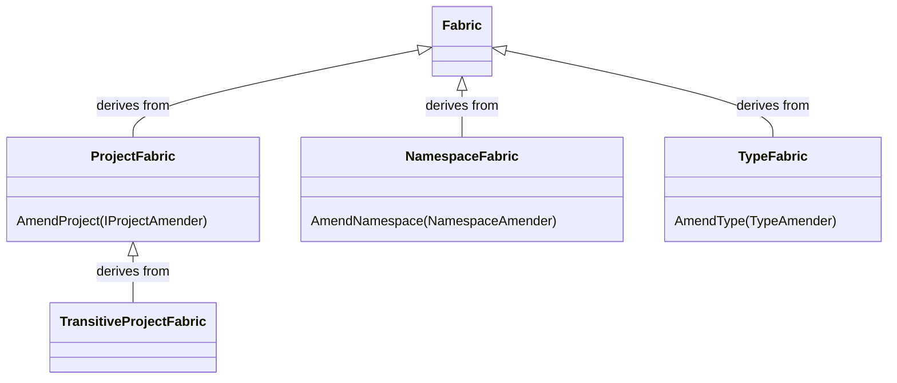
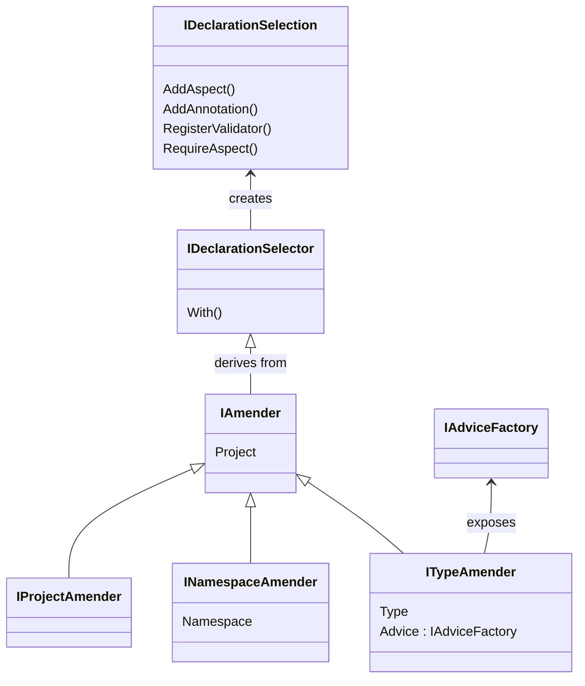

This namespace allows you to add fabrics to your code. Like aspects, fabrics are executed at compile time. Unlike aspects, you do not need a custom attribute to add the fabric to your code. The only existence of the fabric in your code applies it to your code.

There are four kinds of fabrics. Each kind applies to a different scope. All fabric kinds can add aspects and validators within their scope. Type fabrics can additionally add advice to their scope, and project fabrics can set configuration options.

| Kind | Base Class | Scope | Abilities |
|-------|-|---------|--|
| Type Fabrics | <xref:Metalama.Framework.Fabrics.TypeFabric> | The containing type (type fabrics are nested types) and any member. | Add aspects, advice, and validators.
| Namespace Fabrics | <xref:Metalama.Framework.Fabrics.NamespaceFabric> | Any type in the namespace that contains the fabric type. | Add aspects and validators.
| Project Fabrics | <xref:Metalama.Framework.Fabrics.ProjectFabric> | Any type in the project that contains the fabric type or in any project. | Add aspects and validators, and set configuration options. Project fabrics can be inherited from parent directories.
| Transitive Project Fabrics | <xref:Metalama.Framework.Fabrics.TransitiveProjectFabric> | Any type in  any project _referencing_ the containing project. | Add aspects and validators, and set configuration options.

> [!NOTE]
> For design-time performance and usability, it is highly recommended to implement type fabrics in a separate file, and mark the parent class as `partial`.

## Class diagrams

### Fabrics

### Amenders 

## Namespace member