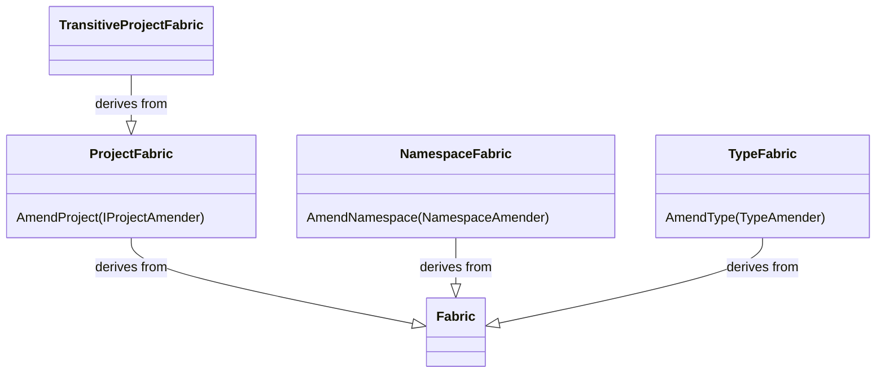
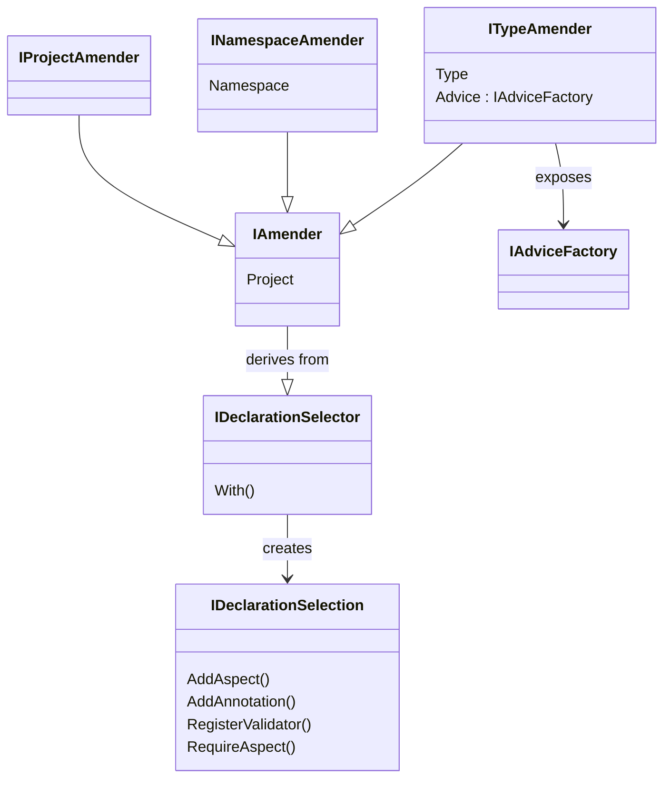

This namespace allows you to add fabrics to your code. Like aspects, fabrics are executed at compile time. Unlike aspects, you do not need a custom attribute to add the fabric to your code. The only existence of the fabric in your code applies it to your code.

Fabrics can be applied to:

* the current project: a _project fabric_ is a type in the project that implements the <xref:Metalama.Framework.Fabrics.ProjectFabric> class,
* all projects that reference the current project: a _transitive project fabric_ is a type in the current project that implements the <xref:Metalama.Framework.Fabrics.TransitiveProjectFabric> class,
* a namespace: a _namespace fabric_ is a type in that namespace that implements the <xref:Metalama.Framework.Fabrics.NamespaceFabric> class,
* a type: a _type fabric_ is a _nested_ type that implements the <xref:Metalama.Framework.Fabrics.TypeFabric> class,

Fabrics can:

* add aspects to code,
* register validators,
* configure aspects (project fabrics only),
* add advice to the current type (type fabrics only)

## Class diagrams

### Fabrics

### Amenders 

## Namespace member