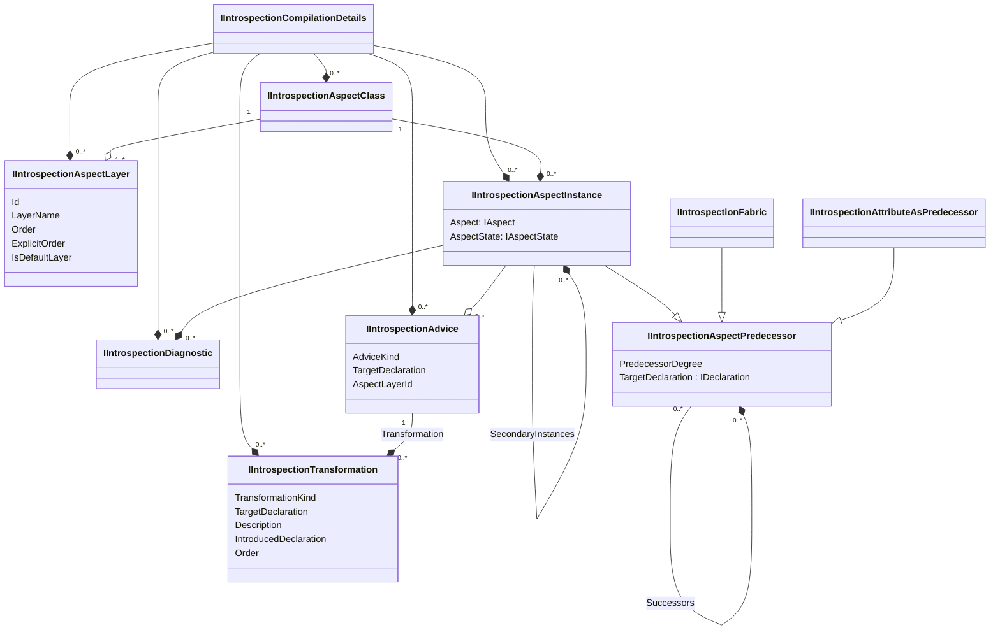

## Overview

This namespace exposes some intermediate details of the compilation process, such as the list of aspect classes, aspect instances, advice, transformations, or diagnostics. 

This namespace is helpful when you want to troubleshoot an aspect, a fabric, or a set of aspects. It gives you details that are not obvious from the compilation output. 

To start with this namespace, you should load your C# project or solution using the <xref:Metalama.Framework.Workspaces> namespace or with the LINQPad driver. See <xref:linqpad> for details.

The entry point of this namespace is the <xref:Metalama.Framework.Introspection.IIntrospectionCompilationDetails> interface. This interface is implemented by the <xref:Metalama.Framework.Workspaces.Workspace> and <xref:Metalama.Framework.Workspaces.Project> classes.

For instance, the following query returns all aspect instances in a project:

```cs
workspace.GetProject("Metalama.Samples.Log4", "net6.0").AspectInstances
```

## Class diagram

