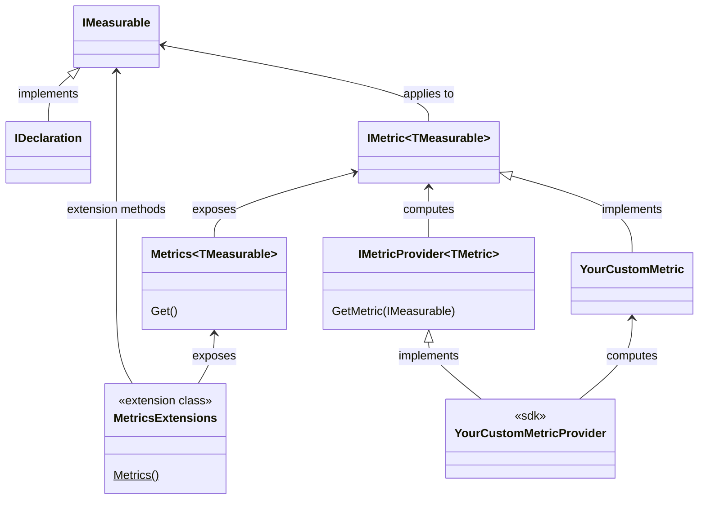

This namespace enables you to consume and implement metrics.

To consume a metric, begin with a declaration, then call the extension method <xref:Metalama.Framework.Metrics.MetricsExtensions.Metrics*?text=MetricsExtensions.Metric>. Afterward, call <xref:Metalama.Framework.Metrics.Metrics`1.Get*>.

## Class Diagram

## Namespace members

