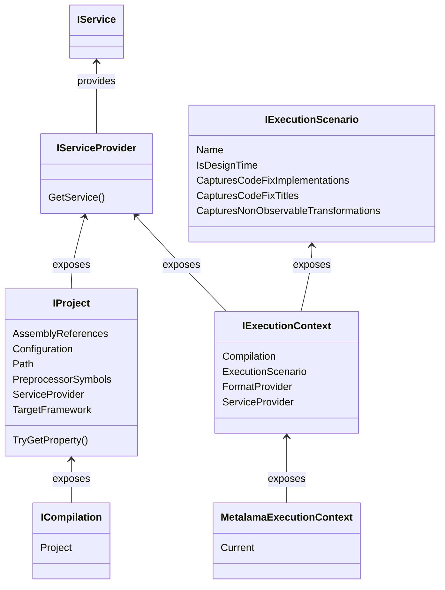

This namespace serves the following purposes:

* It provides read access to the project configuration, which encompasses project references, preprocessor symbols, build properties, and other related information. Refer to the <xref:Metalama.Framework.Project.IProject> interface for more details. This interface can be accessed from any code element through the <xref:Metalama.Framework.Code.ICompilation.Project?text=ICompilation.Project> property.

* It discloses information about the current execution context via the <xref:Metalama.Framework.Project.MetalamaExecutionContext.Current?text=MetalamaExecutionContext.Current> property.

* It reveals the service provider, which facilitates access from high-level code to the low-level plugins.

## Conceptual documentation

Refer to <xref:aspect-configuration>.

## Class diagram

## Namespace members

