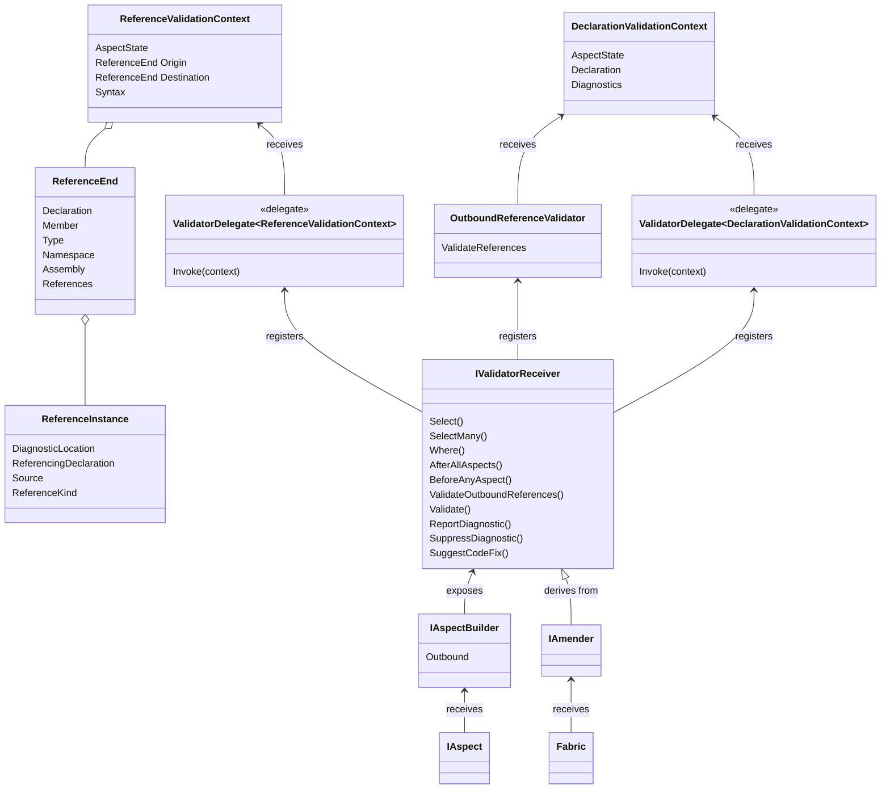

This namespace enables validation of your code, the code that utilizes your aspects, or the code that references the code that uses your aspects.

## Overview

Aspects can register validators from their implementation of <xref:Metalama.Framework.Aspects.IAspect`1.BuildAspect*?text=IAspect.BuildAspect>, and fabrics from their implementation of <xref:Metalama.Framework.Fabrics.TypeFabric.AmendType*>, <xref:Metalama.Framework.Fabrics.NamespaceFabric.AmendNamespace*> or <xref:Metalama.Framework.Fabrics.ProjectFabric.AmendProject*>.

From these methods, invoke the <xref:Metalama.Framework.Validation.IValidatorReceiver`1.SelectMany*?text=amender.SelectMany> method exposed on the `builder` or `amender` parameter, combined with further calls to <xref:Metalama.Framework.Validation.IValidatorReceiver`1.Where*>, <xref:Metalama.Framework.Validation.IValidatorReceiver`1.Select*> or <xref:Metalama.Framework.Validation.IValidatorReceiver`1.SelectMany*>, then call <xref:Metalama.Framework.Validation.IValidatorReceiver.Validate*> or <xref:Metalama.Framework.Validation.IValidatorReceiver`1.ValidateOutboundReferences*>. These methods allow you to register a delegate. This delegate is subsequently called and receives a context object of type <xref:Metalama.Framework.Validation.DeclarationValidationContext> or <xref:Metalama.Framework.Validation.ReferenceValidationContext>. The delegate can then analyze the code or reference, and report diagnostics.

The <xref:Metalama.Framework.Validation.IValidatorReceiver`1.ReportDiagnostic*>, <xref:Metalama.Framework.Validation.IValidatorReceiver`1.SuppressDiagnostic*> and <xref:Metalama.Framework.Validation.IValidatorReceiver`1.SuggestCodeFix*> methods are provided for convenience and utilize <xref:Metalama.Framework.Validation.IValidatorReceiver.Validate*>.

To validate whether an aspect is eligible for a declaration (which involves validating the compilation _before_ the aspect has been applied), implement the <xref:Metalama.Framework.Eligibility.IEligible`1.BuildEligibility*> aspect method.

## Validated revision of the code model

Since aspects can modify the code model, it can be beneficial to be aware of which revision of the code model is being validated.

* The <xref:Metalama.Framework.Validation.IValidatorReceiver`1.ValidateReferences*> always validates the source code. References introduced by aspects cannot be validated.

* By default, fabrics validate the _source_ code. By invoking <xref:Metalama.Framework.Validation.IValidatorReceiver`1.AfterAllAspects>, fabrics can validate the code model after all aspects have been applied.

* By default, aspects validate the code as it is before they are executed (see <xref:aspect-composition>). Call <xref:Metalama.Framework.Validation.IValidatorReceiver`1.AfterAllAspects> to validate the code after all aspects have been applied, or <xref:Metalama.Framework.Validation.IValidatorReceiver`1.BeforeAnyAspect> to validate the source code.

## Class Diagram

## Namespace Members
