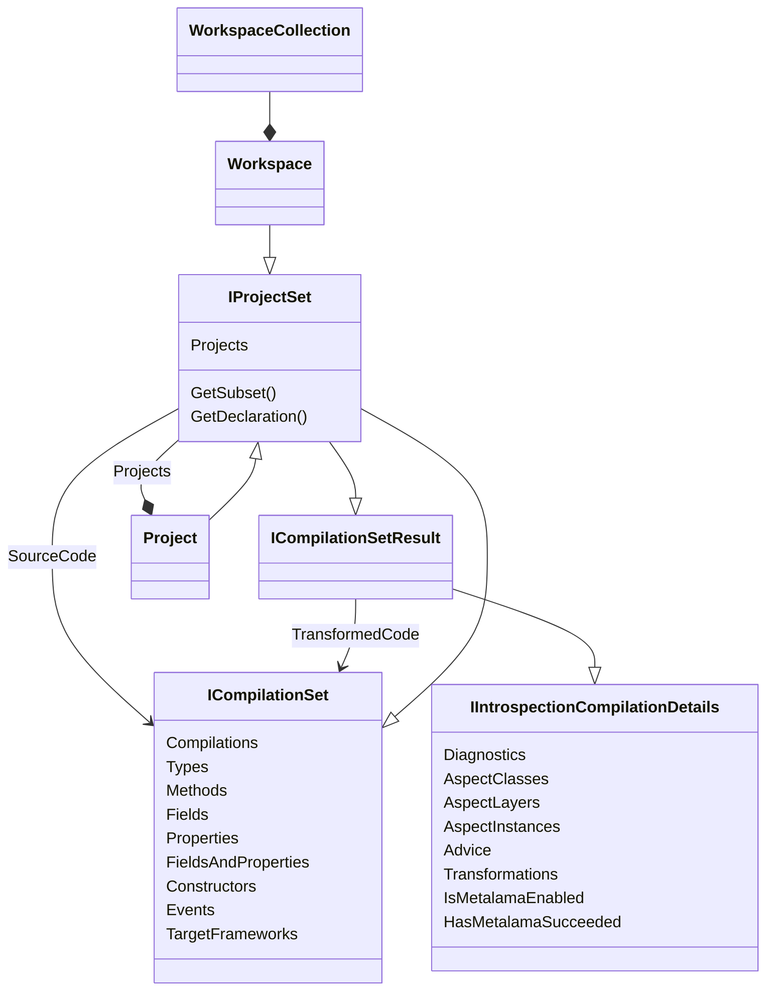

## Overview

This namespace enables the loading of a C# project and solution into the <xref:Metalama.Framework.Code> code model from any application, such as LinqPad.

The entry point of this namespace is the <xref:Metalama.Framework.Workspaces.WorkspaceCollection> class.

## Class Diagram

